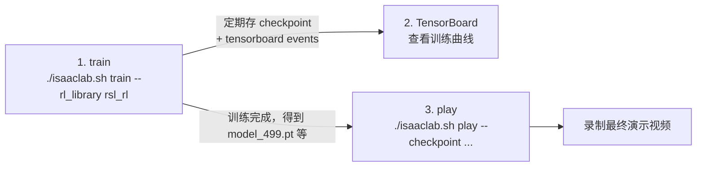

# Isaac Lab 强化学习训练实战记录：以 Go2 机械狗走路为例

本文档记录一次完整的 Isaac Lab RL 训练实践（训练 Unitree Go2 四足机器人平地行走 → 录制训练/评测视频 → 用 TensorBoard 看训练曲线），包含**全部实际执行的命令、真实输出、遇到的报错和对应的根因/解法**。目的是让后续做任何其他 Isaac Lab RL 任务（换机器人、换任务、换奖励设计）时，能直接照搬这套流程，并提前避开这里踩过的坑。

前置说明：环境搭建（Isaac Sim/Isaac Lab 安装、Python 版本、依赖问题等）已在 [`ISAAC_MANUAL.md`](./ISAAC_MANUAL.md) 中详细记录，本文档默认环境已经装好，只聚焦"如何跑一次 RL 训练任务"这个环节的实战细节。

## 目录

1. [任务目标与整体流程](#1-任务目标与整体流程)
2. [第一次尝试：一个容易踩的坑（GPU 占用检查）](#2-第一次尝试一个容易踩的坑gpu-占用检查)
3. [启动训练：完整命令与参数解析](#3-启动训练完整命令与参数解析)
4. [训练过程：如何判断训练是否正常](#4-训练过程如何判断训练是否正常)
5. [TensorBoard：启动与查看训练曲线](#5-tensorboard启动与查看训练曲线)
6. [训练完成后：目录结构与产物](#6-训练完成后目录结构与产物)
7. [录制最终演示视频（play 阶段）——两次报错与修复](#7-录制最终演示视频play-阶段两次报错与修复)
8. [完整踩坑清单（速查表）](#8-完整踩坑清单速查表)
9. [如何拓展到其他 Isaac Lab 任务](#9-如何拓展到其他-isaac-lab-任务)
10. [可复用的命令模板](#10-可复用的命令模板)

---

## 1. 任务目标与整体流程

目标：用 Isaac Lab 内置的 Unitree Go2 四足机器人 velocity-tracking locomotion 任务，跑一次 PPO（通过 rsl_rl 库）训练，让机器狗学会在平地上按指令速度行走，并且：

- 训练过程中定期录制视频。
- 训练完成后用最终 checkpoint 跑一次评测（play），单独录一段"成品"演示视频。
- 全程用 TensorBoard 记录并可视化训练曲线（reward、loss、各奖励分量等）。

整体流程分三步，对应 Isaac Lab 的标准 RL 工作流：



这三步是完全解耦的独立进程，可以在训练还没结束时就先起 TensorBoard 看曲线，也可以训练完之后随时用任意一个中间 checkpoint 去跑 play。

---

## 2. 第一次尝试：一个容易踩的坑（GPU 占用检查）

**在启动训练之前**，先确认 GPU 资源情况，尤其是在同一台机器上可能还有其他任务（比如之前 pi0.5 相关的 policy server）占用显存/算力：

```bash
nvidia-smi --query-gpu=index,name,memory.used,memory.total,utilization.gpu --format=csv
```

实际输出：

```
index, name, memory.used [MiB], memory.total [MiB], utilization.gpu [%]
0, NVIDIA GeForce RTX 5080, 103 MiB, 16303 MiB, 0 %
1, NVIDIA GeForce RTX 5080, 8311 MiB, 16303 MiB, 0 %
```

可以看到 GPU 1 上已经有约 8.3GB 显存被占用（用 `nvidia-smi --query-compute-apps` 查到是一个之前遗留、仍在后台运行的 `serve_policy.py --env LIBERO` 进程）。

**教训**：多任务共享 GPU 服务器时，一定要在训练前检查显存占用，并且**显式**用 `CUDA_VISIBLE_DEVICES=<空闲GPU编号>` 把训练进程绑定到干净的那张卡上，而不是依赖默认行为（默认通常会用 GPU 0，如果 GPU 0 恰好被占也不会主动报错，只会在显存不够时才崩，且报错信息往往具有误导性，例如看起来像是渲染/物理引擎的 bug，而不是"显存不够"，这一点在 `ISAAC_MANUAL.md` §7.3 的 pi0.5 调试记录里也踩过一次同类型的坑）。

本次训练确认 GPU 0 完全空闲，于是全程用 `CUDA_VISIBLE_DEVICES=0`。

---

## 3. 启动训练：完整命令与参数解析

### 3.1 先看帮助，而不是凭记忆写参数

Isaac Lab 的 RL 脚本参数会随版本变化（不同 `--rl_library` 对应的参数也不完全一样），**每次换任务/换库之前先跑一遍 `--help`**，比直接照抄旧命令更可靠：

```bash
cd ~/sim_stack/IsaacLab
source ~/sim_stack/isaac_sim_env/bin/activate
./isaaclab.sh train --rl_library rsl_rl --help
```

关键参数（实际输出节选）：

```
--video                  训练过程中录制视频
--video_length            单段视频长度（step 数）
--video_interval          每隔多少 step 录一次
--num_envs                并行环境数
--task                    任务 ID
--max_iterations          训练迭代次数
--logger {wandb,tensorboard,neptune}   选择日志后端
--experiment_name         日志文件夹名（用于组织 logs/rsl_rl/<experiment_name>/）
--headless                无显示器模式（本机是纯服务器，必须加）
```

注意：直接跑 `./isaaclab.sh train --help`（不带 `--rl_library`）会报错 `the following arguments are required: --rl_library`——`--rl_library` 是第一层必选参数，决定了后面还有哪些参数可用，这也是为什么建议先看两层 `--help`。

### 3.2 实际执行的训练命令

```bash
cd ~/sim_stack/IsaacLab
source ~/sim_stack/isaac_sim_env/bin/activate

CUDA_VISIBLE_DEVICES=0 nohup ./isaaclab.sh train --rl_library rsl_rl \
    --task Isaac-Velocity-Flat-Unitree-Go2-v0 \
    --headless --num_envs 2048 --max_iterations 500 \
    --video --video_length 200 --video_interval 5000 \
    --logger tensorboard --experiment_name go2_walk_demo \
    > ~/sim_stack/train_go2.log 2>&1 &
```

逐项解释：

| 参数 | 取值 | 为什么这么设 |
|---|---|---|
| `--task` | `Isaac-Velocity-Flat-Unitree-Go2-v0` | Isaac Lab 内置任务，平地速度跟踪，Go2 机器人 |
| `--num_envs` | `2048` | 并行仿真环境数，越大数据吞吐越高、单位时间训练进度越快，但受显存限制；2048 在单张 16GB 卡上比较稳妥 |
| `--max_iterations` | `500` | demo 用途不需要跑到几千轮，500 轮足够看到明显的行走行为收敛（实测约 11 分钟） |
| `--video --video_length 200 --video_interval 5000` | — | 每 5000 个仿真 step 录一段 200 step 的视频，训练过程中就能看到策略从"乱动"到"会走"的变化 |
| `--logger tensorboard` | — | 本机没有 wandb/neptune 账号配置，tensorboard 是本地免配置的选项 |
| `--experiment_name go2_walk_demo` | — | 自定义实验名，决定日志目录 `logs/rsl_rl/go2_walk_demo/`，不设的话会用任务默认名（比如之前跑过的 `unitree_go2_flat`），多次实验建议每次换名避免混淆 |
| `nohup ... &` + 重定向到日志文件 | — | 训练要跑十几分钟到几十分钟，放后台运行，日志写文件方便随时 `tail` 查看进度而不占用交互式终端 |

**重要提醒**：用 `nohup ... &` 起后台任务后，当前 shell 会立刻返回，`$!` 拿到的 PID 是 `nohup`/shell 包装出来的这一层，**不一定是真正跑仿真的 Python 进程**。想确认真正在跑的进程，用：

```bash
ps aux | grep train.py | grep -v grep
```

本次实际确认的训练进程：

```
qingyu 65120 373 7.8 ... /home/qingyu/sim_stack/isaac_sim_env/bin/python .../train.py --rl_library rsl_rl --task Isaac-Velocity-Flat-Unitree-Go2-v0 --headless --num_envs 2048 --max_iterations 500 --video --video_length 200 --video_interval 5000 --logger tensorboard --experiment_name go2_walk_demo
```

（CPU 占用 373% 说明多核并行仿真在正常工作。）

---

## 4. 训练过程：如何判断训练是否正常

启动后，`tail -f ~/sim_stack/train_go2.log` 会先看到一大段环境初始化日志（打印 Observation/Action/Reward/Termination/Curriculum Manager 的表格，这是 Isaac Lab manager-based 设计模式的固定输出，参见 `ISAAC_MANUAL.md` §4.1），然后进入训练循环，每轮打印一个 block：

```
################################################################################
                            Learning iteration 5/500
Total steps: 294912
Steps per second: 21025
Collection time: 2.282s
Learning time: 0.055s
Mean value loss: 0.0208
Mean surrogate loss: -0.0081
Mean entropy loss: 16.3691
Mean reward: -3.94
Mean episode length: 129.89
Mean action std: 0.95
Episode_Reward/track_lin_vel_xy_exp: 0.0358
...
Metrics/success_rate: 0.0000
Metrics/base_velocity/error_vel_xy: 0.8338
Episode_Termination/time_out: 0.1339
Episode_Termination/base_contact: 0.0645
--------------------------------------------------------------------------------
Iteration time: 2.34s
Time elapsed: 00:00:16
ETA: 00:22:03
```

**几个判断训练是否健康的关键信号**（不需要盯着 TensorBoard，看日志文本就能大致判断）：

- **`Mean episode length` 应该随训练逐渐变长**：一开始机器人很快摔倒（episode 短），学会走路后能撑到 timeout（episode 变长接近 `num_steps_per_env` 对应的最大长度）。本次训练从 iteration 5 的 129.89 涨到训练末期接近满长度。
- **`Episode_Termination/base_contact` 应该逐渐降低、`time_out` 应该逐渐升高**：`base_contact` 是"机身触地判定为摔倒"而终止，这个比例下降说明机器人越来越少摔倒；`time_out` 是"撑到时间上限正常结束"，这个比例升高是好现象。本次训练最终 `time_out: 0.9985`，`base_contact: 0.0015`，说明几乎不再摔倒。
- **`Metrics/success_rate` 和 `Metrics/base_velocity/error_vel_xy` / `error_vel_yaw`**：`success_rate` 直接反映任务完成情况；速度误差应该随训练下降。本次从初期 `error_vel_xy: 0.83` 降到训练完成时的 `0.11`，`success_rate` 最终达到 `1.0`。
- **`Mean reward` 由负转正、`Episode_Reward/track_lin_vel_xy_exp` 逐渐升高**：主任务奖励项应该是涨的；如果它一直不涨但其他惩罚项在变好，可能是奖励权重配置有问题（本次是用 Isaac Lab 自带的默认配置，没有遇到这个问题）。

如果这些指标长时间（几十个 iteration 后）没有任何改善趋势，通常意味着：奖励函数设计有问题、学习率/PPO 超参数不合适，或者任务本身的观测/动作空间定义有 bug——这时候应该先去看 `Reward Manager` 打印出来的奖励项权重表格，确认没有一个权重全是 0 或者符号搞反的项。

训练全程耗时（本次实测）：

```
Training time: 664.09 seconds   # 约 11 分钟，500 iteration, num_envs=2048
```

---

## 5. TensorBoard：启动与查看训练曲线

### 5.1 启动命令

TensorBoard 是完全独立的进程，指向训练日志目录即可，不需要等训练完成，训练一开始产生 events 文件就能实时看：

```bash
source ~/sim_stack/isaac_sim_env/bin/activate
LOGDIR=~/sim_stack/IsaacLab/logs/rsl_rl/go2_walk_demo
nohup tensorboard --logdir "$LOGDIR" --port 6006 --bind_all > ~/sim_stack/tensorboard.log 2>&1 &
```

- `--bind_all` 让 TensorBoard 监听所有网卡（而不是只监听 `127.0.0.1`），如果需要从局域网内其他机器访问必须加这个参数，纯本机访问也可以不加。
- 指向的是 `logs/rsl_rl/<experiment_name>/`（实验名这一层，而不是某个具体时间戳的子目录），这样如果同一个实验跑了多次（每次会生成一个新的时间戳子目录），TensorBoard 能在同一个界面里对比多次运行的曲线。

### 5.2 确认启动成功

```bash
cat ~/sim_stack/tensorboard.log
```

实际输出：

```
TensorFlow installation not found - running with reduced feature set.
TensorBoard 2.21.0 at http://msra-5442458:6006/ (Press CTRL+C to quit)
```

`TensorFlow installation not found` 只是提示，不影响使用（TensorBoard 本身不强依赖 TensorFlow，只是某些高级功能会受限），只要看到 `TensorBoard ... at http://...` 这一行就说明启动成功。用 `ss -tlnp | grep 6006` 确认端口确实在监听：

```
LISTEN 0 128 *:6006 *:*  users:(("tensorboard",pid=66233,fd=11))
```

浏览器打开 `http://<主机名或IP>:6006/` 即可看到 Scalars 面板，里面按训练日志里打印的同名指标（`Mean reward`、`Episode_Reward/*`、`Metrics/*`、`Loss/*` 等）组织成曲线，可以直接和上一节讲的"看日志文本判断训练健康度"对照着看。

### 5.3 常见问题

- 如果 TensorBoard 面板里看不到曲线：先确认 `--logdir` 路径下确实有 `events.out.tfevents.*` 文件（`find $LOGDIR -name "events.out.tfevents.*"`），如果没有，说明训练脚本这边 `--logger` 没有正确设成 `tensorboard`，或者训练还没跑到第一次写 log 的间隔。
- 多个实验混在一起看不清：给每次训练用不同的 `--experiment_name`，TensorBoard 会自动把子目录分开显示为不同的 "run"，可以在左侧勾选/取消勾选来对比。

---

## 6. 训练完成后：目录结构与产物

训练完成（或中途）后，日志目录结构如下（以本次实验为例）：

```
~/sim_stack/IsaacLab/logs/rsl_rl/go2_walk_demo/2026-07-20_16-34-11/
├── model_0.pt, model_50.pt, model_100.pt, ..., model_499.pt   # 按 save_interval 定期保存的 checkpoint
├── events.out.tfevents.1784536468.msra-5442458.65120.0        # TensorBoard 日志
├── params/
│   ├── agent.yaml    # 本次训练实际生效的 RL 算法超参数（学习率、网络结构等）
│   └── env.yaml      # 本次训练实际生效的环境配置（奖励权重、观测项等）
├── git/
│   └── IsaacLab.diff  # 训练时 IsaacLab 仓库相对于 HEAD 的本地未提交改动快照（可复现性用）
└── videos/
    └── train/
        ├── rl-video-step-0.mp4
        ├── rl-video-step-5000.mp4
        └── rl-video-step-10000.mp4
```

几点说明：

- **`params/agent.yaml` 和 `env.yaml` 是"事后真相"**：无论命令行传了什么参数、代码里默认值是什么，这两个文件记录的是这次训练**实际生效**的完整配置（包括没有通过命令行覆盖的默认值），排查"为什么这次训练和上次不一样"时应该优先看这两个文件的 diff，而不是去猜命令行参数或者代码默认值。
- **`git/IsaacLab.diff`**：如果你在本地改过 Isaac Lab 源码（比如为了适配自定义机器人改了某个 cfg 文件），这个 diff 文件保存了当时的改动快照，配合 checkpoint 一起才能完整复现这次训练结果——这也是为什么"改了源码但没有提交/记录"的训练不具备可复现性，这个 diff 机制帮你兜底记录了一份。
- **checkpoint 保存频率**由 `agent.yaml` 里的 `save_interval` 决定（本次是每 50 个 iteration 存一个），如果只需要最终模型可以只关心 `model_<max_iterations-1>.pt`（注意是 `max_iterations - 1`，比如 500 轮训练最后一个是 `model_499.pt` 而不是 `model_500.pt`，这是训练循环从 0 开始计数导致的，实操中容易搞错文件名）。

---

## 7. 录制最终演示视频（play 阶段）——两次报错与修复

这一步是本次实践中**唯一实际踩坑**的环节，完整记录报错原文和排查过程，因为这类"找不到 checkpoint 文件"的报错在拓展到其他任务时非常容易重复遇到。

### 7.1 第一次尝试（失败）

```bash
CUDA_VISIBLE_DEVICES=0 ./isaaclab.sh play --rl_library rsl_rl \
    --task Isaac-Velocity-Flat-Unitree-Go2-Play-v0 \
    --headless --num_envs 16 \
    --load_run go2_walk_demo/2026-07-20_16-34-11 \
    --checkpoint model_499.pt \
    --video --video_length 300
```

报错：

```
[INFO] Loading experiment from directory: /home/qingyu/sim_stack/IsaacLab/logs/rsl_rl/unitree_go2_flat
Traceback (most recent call last):
  File ".../rsl_rl/play_rsl_rl.py", line 125, in main
    resume_path = retrieve_file_path(args_cli.checkpoint)
FileNotFoundError: Unable to find the file: model_499.pt
```

**关键线索**：`[INFO] Loading experiment from directory` 打印的是 `logs/rsl_rl/unitree_go2_flat`，而不是我们本次训练用的 `go2_walk_demo`！说明 `--load_run` 参数**不是用来指定 experiment_name 的**，`play_rsl_rl.py` 脚本里"实验目录"这一层实际上是由 **`--experiment_name` 参数**决定的（不传的话会退回任务配置里写死的默认实验名，这里是 `unitree_go2_flat`），而 `--load_run` 只是在这个实验目录下面，用来选择"哪个时间戳子目录"。

### 7.2 第二次尝试（仍然失败，但定位到根因）

修正为传 `--experiment_name` + `--load_run`（只传时间戳目录名）：

```bash
CUDA_VISIBLE_DEVICES=0 ./isaaclab.sh play --rl_library rsl_rl \
    --task Isaac-Velocity-Flat-Unitree-Go2-Play-v0 \
    --headless --num_envs 16 \
    --experiment_name go2_walk_demo \
    --load_run 2026-07-20_16-34-11 \
    --checkpoint model_499.pt \
    --video --video_length 300
```

这次日志确认路径对了：

```
[INFO] Loading experiment from directory: /home/qingyu/sim_stack/IsaacLab/logs/rsl_rl/go2_walk_demo
```

但仍然报同样的错：

```
FileNotFoundError: Unable to find the file: model_499.pt
```

**根因**：`--checkpoint` 参数本身**不是"在已解析出的实验目录下找这个文件名"，而是直接把这个字符串交给 `retrieve_file_path()` 当作一个独立的、完整的（相对或绝对）文件路径去解析**（源码 `isaaclab/utils/assets.py:retrieve_file_path`：先检查是不是本地存在的路径，不是的话尝试当作 Nucleus 云端路径下载，两者都不满足就报 `FileNotFoundError`）。也就是说 `--load_run` 只影响"日志加载/展示哪个 run"这类元信息，**不会**自动去拼接 `--checkpoint` 的搜索路径。单独传一个裸文件名 `model_499.pt`，程序只会在当前工作目录（`~/sim_stack/IsaacLab`）下找一个叫这个名字的文件，自然找不到。

### 7.3 最终修复：直接传完整路径

```bash
CUDA_VISIBLE_DEVICES=0 ./isaaclab.sh play --rl_library rsl_rl \
    --task Isaac-Velocity-Flat-Unitree-Go2-Play-v0 \
    --headless --num_envs 16 \
    --checkpoint logs/rsl_rl/go2_walk_demo/2026-07-20_16-34-11/model_499.pt \
    --video --video_length 300
```

（相对于当前工作目录 `~/sim_stack/IsaacLab` 的相对路径，也可以直接用绝对路径，两者都能被 `retrieve_file_path` 正确解析为 `file_status == 1`"本地文件存在"的分支。）这次成功执行，输出里能看到策略网络结构打印和正常的仿真渲染日志，退出码 0。

**教训总结（可直接套用到任何其他任务的 play/evaluate 阶段）**：

> `--checkpoint` 永远传一个能被 `os.path` 直接解析到的、真实存在的文件路径（相对当前工作目录或绝对路径），不要指望它会和 `--experiment_name`/`--load_run` 组合拼接。`--load_run`/`--experiment_name` 只在"不显式传 `--checkpoint` 完整路径、只传目录/正则让脚本自动找最新 checkpoint"这种用法下才生效（此时脚本会在 `logs/rsl_rl/<experiment_name>/<load_run 匹配到的目录>/` 下用 `load_checkpoint` 正则去找文件）。**最不容易出错的方式，永远是直接给完整路径。**

### 7.4 视频产物位置

play 成功执行后，视频存放在：

```
~/sim_stack/IsaacLab/logs/rsl_rl/go2_walk_demo/2026-07-20_16-34-11/videos/play/rl-video-step-0.mp4
```

（和训练过程中的视频在同一个实验目录下，只是子目录从 `videos/train/` 换成了 `videos/play/`，因为 play 阶段用的是同一套 `gymnasium.wrappers.RecordVideo` 机制，只是触发点不同——train 阶段按 `video_interval` 定期触发，play 阶段默认从 step 0 开始录一段。）

拷贝到项目统一的视频目录方便查看/归档：

```bash
cp ~/sim_stack/IsaacLab/logs/rsl_rl/go2_walk_demo/2026-07-20_16-34-11/videos/play/rl-video-step-0.mp4 \
   ~/sim_stack/videos/go2_walk_demo_final.mp4
```

---

## 8. 完整踩坑清单（速查表）

| 现象 | 根因 | 解法 |
|---|---|---|
| 不确定 GPU 是否被其他任务占用，训练/仿真莫名报错或变慢 | 共享 GPU 服务器上有遗留的后台进程（比如别的 policy server）占了显存 | 训练前先 `nvidia-smi --query-gpu=... --format=csv` 和 `nvidia-smi --query-compute-apps=...` 检查，显式用 `CUDA_VISIBLE_DEVICES=<空闲卡号>` 绑定 |
| `./isaaclab.sh train --help` 报 `the following arguments are required: --rl_library` | `--rl_library` 是必选的一级参数，不同库对应不同的二级参数集合 | 先跑 `./isaaclab.sh train --rl_library <库名> --help` 看这个库specific 的参数 |
| `nohup ... &` 之后 `$!` 拿到的 PID 找不到对应仿真进程 / 不确定训练是否真的在跑 | `nohup`/shell 包装了一层，`$!` 不一定是最终的 Python 训练进程 | 用 `ps aux \| grep train.py \| grep -v grep` 找真正的进程，看 CPU/GPU 占用确认在正常运行 |
| play 阶段报 `[INFO] Loading experiment from directory` 指向了错误/默认的实验目录 | 只传了 `--load_run`，没传 `--experiment_name`，脚本用了任务配置里写死的默认实验名 | 同时显式传 `--experiment_name <训练时用的名字>` |
| play 阶段报 `FileNotFoundError: Unable to find the file: model_499.pt`（即使 `--load_run`/`--experiment_name` 都传对了） | `--checkpoint` 只接受一个能直接解析到本地文件系统（或 Nucleus 云端）的完整路径，不会自动拼接实验目录 | `--checkpoint` 直接传相对/绝对完整路径，例如 `logs/rsl_rl/<experiment_name>/<时间戳>/model_499.pt` |
| checkpoint 编号和 `--max_iterations` 对不上（比如以为该有 `model_500.pt`） | 训练迭代计数从 0 开始，`max_iterations=500` 时最后一个 checkpoint 是 `model_499.pt` | 用 `ls logs/rsl_rl/<experiment_name>/<时间戳>/model_*.pt` 直接看实际生成了哪些文件，不要凭猜测拼文件名 |
| TensorBoard 面板空白看不到曲线 | `--logdir` 指错目录层级，或训练还没写出第一批 events | 确认 `find <logdir> -name "events.out.tfevents.*"` 能找到文件；`--logdir` 指向 `logs/rsl_rl/<experiment_name>/`（实验名这一层）而不是某个具体时间戳子目录，方便同时对比多次 run |

---

## 9. 如何拓展到其他 Isaac Lab 任务

这套流程本身与"机器狗走路"这个具体任务无关，核心是 `train → tensorboard → play` 三段式，换其他任务时改动点很小：

### 9.1 换机器人/换地形（同样是 locomotion 任务）

只需要换 `--task`，比如：

```bash
--task Isaac-Velocity-Rough-Unitree-Go2-v0       # 起伏地形而不是平地
--task Isaac-Velocity-Flat-Anymal-C-v0           # 换成 ANYmal-C 机器人
--task Isaac-Velocity-Flat-H1-v0                 # 换成人形机器人 H1
```

评测/play 时同样把 `-v0` 换成对应的 `-Play-v0` 变体（如 `Isaac-Velocity-Rough-Unitree-Go2-Play-v0`），其余流程（`train`/`tensorboard`/`play` 三步、`--checkpoint` 传完整路径的注意事项）完全不变。

### 9.2 换成操作类（manipulation）任务

操作类任务命名规律不同（`Isaac-<任务名>-<机器人>-<控制模式>-v0`，比如 `Isaac-Lift-Cube-Franka-v0`），但 CLI 使用方式一致：先 `./isaaclab.sh train --rl_library <库> --help` 确认参数，同样传 `--task`/`--experiment_name`/`--video` 等。注意有相机观测的操作任务（`Visuomotor` 后缀）显存开销更大，`--num_envs` 需要适当调小，避免显存不足（判断方法见 `ISAAC_MANUAL.md` §7.5 和本文档 §2）。

### 9.3 换 RL 库

把 `--rl_library rsl_rl` 换成 `rl_games`/`sb3`/`skrl`/`rlinf`，注意：

- 不同库的二级参数不完全一样（务必重新跑一遍该库的 `--help`，不要照抄 rsl_rl 的参数直接套用）。
- 不同库的 checkpoint 文件格式和目录结构可能不同，`play` 时同样需要先确认真实生成的文件名/路径，再传完整路径给 `--checkpoint`（同 §7.3 的教训）。
- `--logger tensorboard` 是 rsl_rl 的选项，其他库是否支持、参数名是否一致需要单独确认。

### 9.4 自定义奖励/观测（新增任务）

如果要在现有任务基础上改奖励权重或加新的观测项，改动的是 Python 任务配置类（不是命令行参数），大致路径：

1. 在 `source/isaaclab_tasks/isaaclab_tasks/manager_based/locomotion/velocity/config/go2/` 这类目录下找到对应任务的 env cfg（比如 `flat_env_cfg.py`），复制一份改名成自己的任务变体。
2. 修改其中的 `RewardsCfg`（奖励项权重）/`ObservationsCfg`（观测项）/`EventCfg`（域随机化）等 Manager 配置类字段。
3. 用 `gym.register(...)`（通常在该目录的 `__init__.py` 里）注册一个新的任务 ID。
4. 之后训练命令的 `--task` 直接指向你新注册的任务 ID，其余流程不变。

改完源码之后，别忘了 §6 提到的 `params/env.yaml` 和 `git/IsaacLab.diff`——它们是验证"这次改动是否真的生效"、以及后续复现这次训练结果的重要依据，训练跑起来之后可以先检查这两个文件确认改动确实被加载了。

---

## 10. 可复用的命令模板

把本次实践跑通的完整命令整理成模板，换任务时只需要替换 `<...>` 部分：

```bash
# ===== 0. 训练前检查 GPU =====
nvidia-smi --query-gpu=index,name,memory.used,memory.total,utilization.gpu --format=csv
nvidia-smi --query-compute-apps=pid,used_memory,gpu_uuid --format=csv

# ===== 1. 启动训练（后台） =====
source ~/sim_stack/isaac_sim_env/bin/activate
cd ~/sim_stack/IsaacLab
CUDA_VISIBLE_DEVICES=<空闲GPU编号> nohup ./isaaclab.sh train --rl_library rsl_rl \
    --task <任务ID> \
    --headless --num_envs <并行环境数> --max_iterations <迭代数> \
    --video --video_length 200 --video_interval 5000 \
    --logger tensorboard --experiment_name <自定义实验名> \
    > ~/sim_stack/train_<实验名>.log 2>&1 &

# 确认真正的训练进程
ps aux | grep train.py | grep -v grep

# 实时看进度
tail -f ~/sim_stack/train_<实验名>.log

# ===== 2. 启动 TensorBoard（可随时起，不用等训练结束） =====
nohup tensorboard --logdir ~/sim_stack/IsaacLab/logs/rsl_rl/<实验名> --port 6006 --bind_all \
    > ~/sim_stack/tensorboard.log 2>&1 &
cat ~/sim_stack/tensorboard.log   # 确认 "TensorBoard ... at http://..." 这一行

# ===== 3. 训练结束后，查看实际生成的 checkpoint 文件名 =====
ls ~/sim_stack/IsaacLab/logs/rsl_rl/<实验名>/<时间戳目录>/model_*.pt

# ===== 4. play：录制最终演示视频（--checkpoint 一定用完整路径！） =====
cd ~/sim_stack/IsaacLab
CUDA_VISIBLE_DEVICES=<空闲GPU编号> ./isaaclab.sh play --rl_library rsl_rl \
    --task <对应的 -Play-v0 任务ID> \
    --headless --num_envs 16 \
    --checkpoint logs/rsl_rl/<实验名>/<时间戳目录>/<checkpoint文件名>.pt \
    --video --video_length 300

# ===== 5. 拷贝最终视频到统一目录归档 =====
cp ~/sim_stack/IsaacLab/logs/rsl_rl/<实验名>/<时间戳目录>/videos/play/rl-video-step-0.mp4 \
   ~/sim_stack/videos/<实验名>_final.mp4
```
