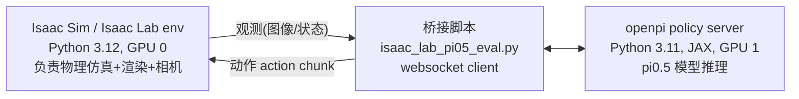
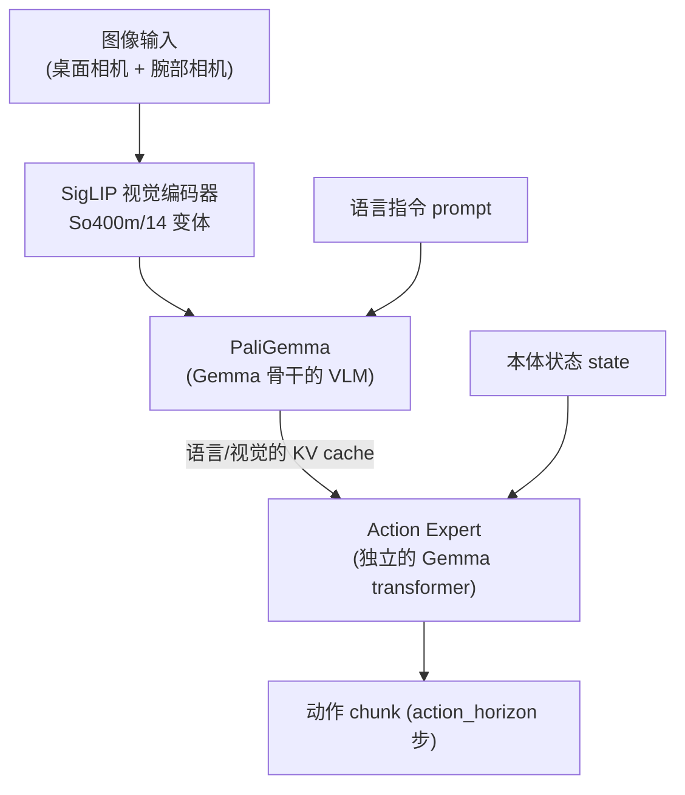

# Isaac Sim / Isaac Lab + pi0.5 完整使用说明书

本书是 [`ISAAC_SIM_PI05_SETUP.md`](./ISAAC_SIM_PI05_SETUP.md)（技术记录）和 [`QUICKSTART.md`](./QUICKSTART.md)（速查手册）的合并升级版：**包含两者的全部内容**，并在每个关键步骤补充"这是什么、为什么这么设计"的原理讲解，以及对关键代码逐段的解释。目标是让一个没有 Isaac Sim / VLA 背景的人，读完能既会用、又懂原理。

## 目录

1. [整体架构与背景](#1-整体架构与背景)
2. [基础概念：Isaac Sim 技术栈](#2-基础概念isaac-sim-技术栈)
3. [环境搭建](#3-环境搭建)
4. [用 Isaac Sim / Isaac Lab 做仿真](#4-用-isaac-sim--isaac-lab-做仿真)
5. [pi0.5 模型原理](#5-pi05-模型原理)
6. [Isaac Lab ↔ pi0.5 桥接：逐行代码解读](#6-isaac-lab--pi05-桥接逐行代码解读)
7. [端到端运行结果](#7-端到端运行结果)
8. [pi0.5 微调](#8-pi05-微调)
9. [Isaac Lab 强化学习训练（以四足机械狗为例）](#9-isaac-lab-强化学习训练以四足机械狗为例)
10. [环境清单 / 踩坑速查表](#10-环境清单--踩坑速查表)
11. [后续可选方向](#11-后续可选方向)

---

## 1. 整体架构与背景

### 1.1 任务目标

在本机（Ubuntu 22.04，双 RTX 5080，CUDA 13.0 驱动，无 docker）部署 NVIDIA Isaac Sim，并让 Physical Intelligence 的 pi0.5 VLA（Vision-Language-Action）模型在仿真环境里跑抓取/操作任务的推理测试，同时把整套流程沉淀成可复现的文档。

### 1.2 为什么不能把两者装进同一个环境

- Isaac Sim 6.0.1 的 pip 包要求 **Python 3.12**。
- openpi（pi0.5 所在仓库）用 **Python 3.11**，并锁定了 JAX 0.5.3 (cuda12) / PyTorch 2.7.1 / transformers 4.53.2 这样一套特定版本组合。
- 这两套依赖树（尤其是 CUDA 相关的原生扩展）互相装在一起大概率会有版本冲突或者运行时符号冲突，即使解决了依赖冲突，两个重量级 CUDA 消费者（Kit 渲染器的 RTX 管线 + JAX 的 XLA 运行时）挤在一个进程里，显存管理也会互相打架（这一点在 §7.4 会详细展开，也是我们实际踩到的坑）。

所以采用了 **两个独立虚拟环境 + 网络协议桥接** 的架构，而不是揉进一个环境：



这个模式并不是我们发明的——openpi 官方跑 LIBERO benchmark 时用的就是同一套 "policy server + websocket client" 协议，我们只是新写了一个 **Isaac Lab 版本的 client**（即 `isaac_lab_pi05_eval.py`），把 LIBERO 换成了 Isaac Lab 的仿真环境。这样做的好处：

- 两个环境的 Python 版本/依赖完全隔离，互不影响。
- 通信只走一个 websocket 协议（发 JSON/numpy 数组），协议本身很薄，出问题容易定位是"仿真侧"还是"模型侧"。
- 天然支持把两个进程分别绑定到两张不同的 GPU 上（`CUDA_VISIBLE_DEVICES`），这对我们后来解决显存抢占问题至关重要。

---

## 2. 基础概念：Isaac Sim 技术栈

在动手之前，先搞清楚几个经常被混用的名词，它们其实是分层的：

| 层级 | 名称 | 是什么 | 类比 |
|---|---|---|---|
| 最底层 | **PhysX** | NVIDIA 的物理引擎，负责刚体动力学、碰撞检测、关节约束求解。可以跑在 GPU 上（并行仿真成千上万个环境） | 游戏引擎里的"物理引擎" |
| 底层（可选） | **Warp** | NVIDIA 的 Python→CUDA 内核编译框架，用来写高性能的自定义物理/几何计算（比如可变形体、粒子、自定义传感器噪声模型），比手写 CUDA C++ 快开发 | 让你用 Python 写"能跑在 GPU 上的 for 循环" |
| 场景描述 | **USD (Universal Scene Description)** | Pixar 开源的 3D 场景描述格式/框架，Omniverse 生态全部基于 USD 来描述场景（几何体、材质、灯光、物理属性都编码在 USD stage 里） | 3D 场景的"文件格式 + 场景图数据库" |
| 应用框架 | **Omniverse Kit** | NVIDIA 基于 USD 构建的可扩展应用框架（插件化架构，每个功能是一个 "extension"），渲染器（RTX Renderer，基于光线追踪）也是 Kit 的一个扩展 | 类似 Unity/Unreal 的"编辑器内核"，但是插件化、面向 USD |
| 应用层 | **Isaac Sim** | 基于 Omniverse Kit 搭建的机器人仿真应用，本质上是"Kit + 一堆机器人相关的 extension（PhysX 集成、传感器插件、ROS 桥接等）" | 具体的机器人仿真软件产品 |
| 任务/RL 层 | **Isaac Lab** | 建在 Isaac Sim 之上的 **gym 风格框架**，提供开箱即用的机器人任务（操作/移动）、标准化的 Manager-based 环境设计模式、和 RL 训练库（rsl_rl/rl_games/skrl/sb3 等）的对接 | 相当于 "Isaac Sim 是引擎，Isaac Lab 是 Gymnasium + 一堆预制关卡" |

**为什么要分这么多层？** 因为 Isaac Sim 本身只提供"渲染 + 物理仿真"的能力，并不是一个 gym 环境——它没有 `reset()`/`step()`/`observation_space` 这些强化学习/机器人学习框架期望的标准接口。Isaac Lab 就是在 Isaac Sim 之上加了一层"任务定义 + gym 接口"，让你可以像用 `gymnasium.make("CartPole-v1")` 一样 `gym.make("Isaac-Stack-Cube-Franka-...")`。这也是为什么本项目既要装 Isaac Sim 又要装 Isaac Lab——前者是运行时底座，后者是我们真正编程调用的 API 层。

**一个常见误解**：Isaac Sim 里的 "Kit" 不是"游戏引擎"，而是一套面向 USD 场景的插件宿主。如果你在 headless（无显示器）服务器上跑，是不需要打开 Kit 的图形界面窗口的，这也是后面 §10 "headless 卡死" 那个坑的根源。

---

## 3. 环境搭建

### 3.1 依赖工具：uv

我们用 [uv](https://github.com/astral-sh/uv) 来管理 Python 版本和虚拟环境，而不是 apt/conda，原因：不需要 sudo 权限，可以在同一台机器上并存管理多个 Python 版本（3.11、3.12），且 `uv venv --python 3.12` 会自动下载对应版本的 CPython，不依赖系统包管理器。

```bash
curl -LsSf https://astral.sh/uv/install.sh | sh
```

### 3.2 环境一：Isaac Sim + Isaac Lab（Python 3.12）

```bash
mkdir -p ~/sim_stack && cd ~/sim_stack

uv venv isaac_sim_env --python 3.12
source isaac_sim_env/bin/activate

uv pip install "isaacsim[all,extscache]==6.0.1.0" \
    --extra-index-url https://pypi.nvidia.com \
    --index-strategy unsafe-best-match \
    --prerelease allow

OMNI_KIT_ACCEPT_EULA=YES python -c "import isaacsim"   # 首次运行需要确认 EULA
deactivate
```

**这几个参数在做什么：**

- `isaacsim[all,extscache]` — `[all]` 是 extras，装全部子模块（不装的话只有最小核心，缺很多 extension）；`extscache` 是把常用 extension 的二进制缓存也一起下载下来，避免运行时首次启动再联网拉取。
- `--extra-index-url https://pypi.nvidia.com` — Isaac Sim 的 wheel 托管在 NVIDIA 自己的 PyPI 镜像上，不在官方 PyPI。
- `--index-strategy unsafe-best-match` — 当依赖分布在多个 index（官方 PyPI + NVIDIA index）时，uv 默认是"每个包只从第一个能找到它的 index 拿版本"，这在处理跨 index 依赖时容易解析失败（我们实测遇到了 `mujoco-usd-converter` 版本冲突）；改成 `unsafe-best-match` 后允许 uv 跨所有 index 比较版本号选最优解。
- `--prerelease allow` — 依赖树里有 `tinyobjloader==2.0.0rc13` 这样的预发布版本号，uv 默认拒绝预发布版本，需要显式放开。
- `OMNI_KIT_ACCEPT_EULA=YES` — Isaac Sim 首次 `import` 时会尝试交互式弹出 EULA 确认（在无显示器的终端里会导致进程挂起等待输入），设这个环境变量等价于提前替你确认同意。

**为什么锁 `==6.0.1.0` 这个具体版本**：因为 Isaac Lab 的分支和 Isaac Sim 版本是强绑定的（见下一节），装了不匹配的 Isaac Sim 版本会导致 Isaac Lab 报内部 API 不存在的错误。

### 3.3 Isaac Lab

```bash
git clone https://github.com/isaac-sim/IsaacLab.git
cd IsaacLab && git checkout release/3.0.0-beta2   # 对应 Isaac Sim 6.0.1；main 分支对应 5.1.0
source ~/sim_stack/isaac_sim_env/bin/activate
./isaaclab.sh --install
deactivate
cd ..
```

**版本匹配踩坑**：一开始按惯性用了 `main` 分支，起 Isaac Lab 环境时报：

```
ModuleNotFoundError: No module named 'omni.physics.tensors.impl'
```

原因是 `main` 分支对应的是 Isaac Sim 5.1.0 的内部模块路径，而我们装的是 6.0.1.0，内部模块结构变了。**修复**：切换到 `release/3.0.0-beta2` 分支，这是官方对应 6.0.1 的分支（写这份文档时 6.0.1 系列还没出正式的非 beta Isaac Lab release，所以只能用 beta 分支，这也解释了下面的资产路径 bug 为什么会存在）。

**已知资产路径 bug**：Isaac Lab beta 分支引用的 Franka 机械臂 USD 资产路径，和 Isaac Sim 6.0 云端资产库实际的目录结构不一致（云端把文件挪到了 `Legacy/` 子目录下，beta 分支代码没跟着更新）：

```python
# ~/sim_stack/IsaacLab/source/isaaclab_assets/isaaclab_assets/robots/franka.py
# 原始（404）:
usd_path=f"{ISAACLAB_NUCLEUS_DIR}/Robots/FrankaEmika/panda_instanceable.usd",
# 改成:
usd_path=f"{ISAACLAB_NUCLEUS_DIR}/Robots/FrankaEmika/Legacy/panda_instanceable.usd",
```

一行 sed 即可打上这个补丁：

```bash
sed -i 's#Robots/FrankaEmika/panda_instanceable.usd#Robots/FrankaEmika/Legacy/panda_instanceable.usd#' \
    ~/sim_stack/IsaacLab/source/isaaclab_assets/isaaclab_assets/robots/franka.py
```

（我们是用云端资产桶的 S3 ListBucket API 查询实际目录结构，确认文件确实在 `Legacy/` 下之后才确定这是路径 bug 而不是资产真的丢失。）

### 3.4 环境二：openpi（pi0.5），Python 3.11

```bash
git clone https://github.com/Physical-Intelligence/openpi
cd openpi
UV_PROJECT_ENVIRONMENT=~/sim_stack/openpi_env uv sync
cd ..
```

`uv sync` 会按 `openpi` 仓库自带的 `pyproject.toml`/`uv.lock` 精确复现官方锁定的依赖版本（JAX 0.5.3 cuda12、PyTorch 2.7.1、transformers 4.53.2 等），装到 `~/sim_stack/openpi_env` 这个独立目录，不影响 3.12 那个环境。

### 3.5 打通两个环境：openpi-client

`isaac_sim_env`（3.12）这边跑桥接脚本时，需要能 `import openpi_client`（负责 websocket 通信和图像预处理的小工具包），但**不能**把完整的 openpi（连带 JAX/PyTorch）也装进 3.12 环境——那样又违背了"环境隔离"的初衷，而且 openpi 主包不支持 3.12。解决办法是只装 `openpi-client` 这个轻量子包，且显式 `--no-deps`（不装它的依赖，因为它的依赖已经被 Isaac Sim 环境里其他包满足，或者根本用不上）：

```bash
source ~/sim_stack/isaac_sim_env/bin/activate
uv pip install --no-deps -e ~/sim_stack/openpi/packages/openpi-client
deactivate
```

---

## 4. 用 Isaac Sim / Isaac Lab 做仿真

### 4.1 两个 API 层级

写 Isaac Lab 相关代码时，实际上在和两层 API 打交道：

1. **底层：`SimulationApp`**（Isaac Sim 原生 API）——这是整个 Kit 进程的入口，必须在 import 任何 `isaacsim.*`/`isaaclab.*` 模块之前先实例化它，因为很多模块是 Kit 的 extension，只有 Kit app 启动后才能被 import。典型写法：

   ```python
   from isaacsim.simulation_app import SimulationApp
   simulation_app = SimulationApp({"headless": True})
   # 只有到这里之后，才能 import 依赖 Kit 扩展系统的模块
   import isaaclab_tasks
   ```

2. **上层：Isaac Lab 的 gym 环境层**——`gym.make(task_id, cfg=env_cfg)` 返回一个标准 gymnasium 接口的环境（`reset()`/`step()`/`observation_space`/`action_space`），内部按 **Manager-based** 设计模式组织：

   | Manager | 职责 |
   |---|---|
   | Observation Manager | 定义 obs 里有哪些字段（图像、关节角度、末端位姿…），怎么从仿真状态里读出来、按什么顺序拼接 |
   | Action Manager | 把策略输出的 action 向量映射到具体的关节力矩/位置目标（比如差分逆运动学 IK） |
   | Reward Manager | RL 任务专用：定义奖励项及权重 |
   | Termination Manager | 定义什么条件下一个 episode 结束（成功/失败/超时） |
   | Event Manager | 域随机化（domain randomization）：每次 reset 随机化物体位置、摩擦系数等 |
   | Curriculum Manager | 训练过程中动态调整任务难度 |

   每个任务（比如 `Isaac-Stack-Cube-Franka-IK-Rel-Visuomotor-v0`）本质上就是一个 Python 配置类，声明式地把这些 Manager 的具体规则填进去，而不是写命令式的仿真循环代码——这是 Isaac Lab 相对于"直接用 Isaac Sim 原生 API 写仿真脚本"的核心价值：把"任务定义"和"仿真循环"解耦。

### 4.2 标准脚本骨架

`isaac_lab_pi05_eval.py`（我们的桥接脚本）遵循的就是 Isaac Lab 官方示例脚本的标准骨架，核心步骤：

```python
# 1. 解析命令行参数，包括 Isaac Lab 启动器公共参数（headless/设备/可视化模式等）
add_launcher_args(parser)
args_cli, hydra_args = setup_preset_cli(parser)

# 2. 解析任务配置（不同任务对应不同的 Manager 配置类）
env_cfg, _ = resolve_task_config(args_cli.task, "")

# 3. 用 context manager 启动仿真 App（进入这个 with 块之后 Kit 才真正跑起来）
with launch_simulation(env_cfg, args_cli):
    # 4. 用 gymnasium 接口创建环境
    env = gym.make(args_cli.task, cfg=env_cfg)
    # 5. 标准 RL 循环：reset -> step -> ... -> done
    obs, _ = env.reset()
    ...
    obs, reward, terminated, truncated, info = env.step(action)
```

`launch_simulation` 这个 context manager 封装了 "启动 SimulationApp → 进入循环 → 退出时优雅关闭 App" 的整个生命周期，这也是为什么脚本里看不到显式的 `SimulationApp(...)` 调用——它被 Isaac Lab 的 `isaaclab_tasks.utils` 工具函数封装掉了，简化了样板代码。

### 4.3 决速：物理频率 vs 控制频率 vs 渲染频率

这是初学者最容易搞混的一点，也是我们通过阅读 Isaac Lab 源码（`ManagerBasedRLEnv.step()`，位于 `source/isaaclab/isaaclab/envs/manager_based_rl_env.py`）确认的机制。关键代码（简化摘录）：

```python
def step(self, action: torch.Tensor) -> VecEnvStepReturn:
    # 处理一次策略给出的 action（在这一次 env.step() 调用期间保持不变）
    self.action_manager.process_action(action.to(self.device))
    ...
    for _ in range(self.cfg.decimation):
        self._sim_step_counter += 1
        self.action_manager.apply_action()   # 把 action 应用到执行器（每个物理子步都重新下发一次）
        self.scene.write_data_to_sim()
        self.sim.step(render=False)           # 物理子步：不渲染，只推进物理
        ...
        if self._sim_step_counter % self.cfg.sim.render_interval == 0 and is_rendering:
            self.sim.render(...)              # 只在满足 render_interval 时才真正渲染一帧
    self.scene.update(dt=self.step_dt)
```

也就是说，**一次 `env.step(action)` 调用（对策略/RL 算法而言是"一个控制步"）内部会循环执行 `cfg.decimation` 次物理子步**，每个物理子步都用同一个 action、以更精细的时间步长 `physics dt` 去推进物理仿真；只有当子步计数达到 `render_interval` 的整数倍时才真正渲染一帧画面（渲染比物理更贵，没必要每个物理子步都渲染）。

这样设计有三层好处：

1. **物理稳定性**：接触/碰撞求解在更小的时间步长下更稳定，用小 dt 做物理但用大 dt 做决策，两者可以独立调节。
2. **性能**：渲染远比物理步进昂贵，`render_interval` 让你按需渲染（比如每 2 个物理步渲染一次）。
3. **策略解耦**：策略（无论是 pi0.5 还是 PPO）只需要关心"控制步"这个粒度，不需要知道底层物理仿真跑得比它快多少倍。

我们在实际运行日志里看到的具体数字（"Physics step-size: 0.01, Rendering step-size: 0.02, Environment step-size: 0.05"）就是这三层频率的体现：物理以 100Hz 步进，渲染以 50Hz 更新，而策略（环境）以 20Hz 做决策——即 `decimation = 5`（每个控制步跑 5 个物理子步，0.05 / 0.01 = 5）。

### 4.4 任务发现

```bash
source ~/sim_stack/isaac_sim_env/bin/activate
python -c "
import gymnasium as gym
import isaaclab_tasks  # 触发所有任务的 gym.register()
for k in sorted(gym.registry.keys()):
    if k.startswith('Isaac-'):
        print(k)
"
```

任务命名规律：

- 操作任务：`Isaac-<任务名>-<机器人>-<控制模式>-v0`，比如 `Isaac-Stack-Cube-Franka-IK-Rel-Visuomotor-v0`（`IK-Rel` = 相对末端位姿的差分逆运动学控制；`Visuomotor` 后缀表示带相机图像观测，这是我们对接 pi0.5 时必须选的一类，因为 pi0.5 是视觉输入的模型）。
- 移动任务：`Isaac-Velocity-<Flat|Rough>-<机器人>-v0`（+ `-Play-v0` 变体用于评测/录视频而非训练）。

### 4.5 GPU 资源规划

Isaac Sim 的渲染（RTX 光追管线）和物理仿真（PhysX GPU 后端）本身就会占用相当一部分显存和算力，如果同一张卡上还要跑 pi0.5 的 JAX 推理，会出现显存抢占问题（详见 §6.2 debugging 部分和 §10 速查表）。推荐用 `CUDA_VISIBLE_DEVICES` 把仿真进程和模型 server 进程分别绑定到两张不同的物理 GPU 上。

---

## 5. pi0.5 模型原理

### 5.1 整体架构

pi0.5 是 Physical Intelligence 的 VLA（Vision-Language-Action）模型，在 openpi 仓库里对应 `Pi0` 类（`src/openpi/models/pi0.py`），配置项 `Pi0Config(pi05=True)`（`src/openpi/models/pi0_config.py`）。核心架构由三部分组成：



关键实现细节（对应 `Pi0.__init__`）：

```python
llm = nnx_bridge.ToNNX(
    _gemma.Module(
        configs=[paligemma_config, action_expert_config],  # 两个 transformer 共享同一套 attention 层实现，但各自独立权重
        embed_dtype=config.dtype,
        adarms=config.pi05,          # pi0.5 特有：启用 AdaRMS 条件化
    )
)
llm.lazy_init(rngs=rngs, method="init", use_adarms=[False, True] if config.pi05 else [False, False])
```

- **两个 "专家"（experts）共享 attention 计算但权重独立**：`configs=[paligemma_config, action_expert_config]` 表示这是一个"双专家"的 Gemma 模块——一个专家处理视觉/语言 token（PaliGemma），另一个专家专门处理动作相关的 token（action expert）。它们在同一次前向传播里通过 attention 互相看到对方（语言/视觉信息借助 attention 传给动作专家），但各自的参数是独立的，动作专家可以比 PaliGemma 小得多。
- **AdaRMS（Adaptive RMSNorm）是 pi0.5 相对 pi0 的关键区别**：`use_adarms=[False, True]` 表示只有 action expert 那一路启用 AdaRMS，即用某个条件信号（这里是扩散/flow-matching 的时间步 `t`）去动态调制 RMSNorm 的缩放系数，而不是像 pi0 那样把时间步信息和状态、动作 concat 在一起过 MLP：

  ```python
  # pi0（非 pi05）：状态和动作时间步显式过 MLP 融合
  self.state_proj = nnx.Linear(config.action_dim, action_expert_config.width, rngs=rngs)
  self.action_time_mlp_in = nnx.Linear(2 * action_expert_config.width, action_expert_config.width, rngs=rngs)
  self.action_time_mlp_out = nnx.Linear(action_expert_config.width, action_expert_config.width, rngs=rngs)

  # pi0.5：时间步走 AdaRMS 条件化通路，不需要显式 state_proj/action_time_mlp
  self.time_mlp_in = nnx.Linear(action_expert_config.width, action_expert_config.width, rngs=rngs)
  self.time_mlp_out = nnx.Linear(action_expert_config.width, action_expert_config.width, rngs=rngs)
  ```

  直观理解：AdaRMS 是"用时间步信息去调制每一层归一化的 scale/shift"，比"把时间步 embedding 和其他特征拼一起过 MLP 再送进 transformer"更参数高效、梯度路径更直接，这是扩散模型（如 DiT）里常见的条件注入方式，pi0.5 把它借鉴过来。

### 5.2 Flow Matching：动作是怎么生成的

pi0/pi0.5 不是直接回归动作，而是用 **flow matching**（和扩散模型同源的一种生成建模方法）来建模动作分布。核心思想：

- **训练时**：从真实动作 `actions`（专家演示数据里的动作）出发，采样一个随机噪声 `noise` 和一个随机时间 `t ∈ [0, 1]`，构造一个"噪声和真实动作的线性插值"：

  ```python
  noise = jax.random.normal(...)
  x_t = t * noise + (1 - t) * actions       # t=1 时是纯噪声，t=0 时是真实动作
  u_t = noise - actions                      # 目标：从 x_t 出发指向 noise 方向的"速度场"
  ```

  模型被训练去预测这个速度场 `u_t`（给定当前带噪动作 `x_t`、时间 `t`、以及视觉/语言观测），这是一个简单的回归损失（预测值和 `u_t` 的 MSE），比扩散模型常见的"预测噪声"在数学上是等价的一种参数化方式，但训练/推理路径通常更简单、采样步数可以更少。

- **推理时**：从纯噪声 `x_1 = noise`（`t=1`）出发，用模型预测的速度场，沿着 `t: 1 → 0` 反向积分，每一步用类似 ODE 求解器的方式把 `x_t` 往 `t=0`（真实动作）方向推进一点。openpi 里用 `jax.lax.while_loop` 实现这个迭代去噪循环（`sample_actions` 方法），循环若干步（比 SigLIP/PaliGemma 的前向传播要少得多）就能得到最终的干净动作。

- **为什么用 flow matching 而不是直接回归动作**：机器人操作里，给定同一个观测，可能存在多个同样合理的动作（比如从不同角度接近同一个物体），直接用 L2 回归会导致模型学到"多个合理答案的平均值"（这个平均值本身可能不是一个合理动作，比如两个方向的平均是一个撞到障碍物的方向）。Flow matching/扩散建模的是一个完整的动作*分布*，可以采样出多峰分布里某一个具体、清晰的模式，而不是模糊的平均值。

### 5.3 Action Chunking（动作分块）

pi0.5 单次推理不是输出一个动作，而是输出一整段未来动作序列（一个 "chunk"）：

```python
action_horizon: int = 50   # Pi0Config 默认值：一次推理产出 50 步的动作序列
```

在实际执行时（见 §6 桥接脚本），不会每一步都重新调用一次模型推理（那样太慢，且模型是几百 ms 级别的推理延迟，跟不上仿真/真实机器人的控制频率），而是：

1. 调一次模型，拿到 50 步的 action chunk。
2. 只执行其中前 `replan_steps`（比如 5）步。
3. 执行完这几步后，用最新的观测重新调用模型，拿新的 chunk，继续执行。

这样做的权衡：`replan_steps` 越小，"实时性"越好（对环境变化的反应更灵敏，因为更新观测更频繁），但推理调用更频繁、对模型 server 的吞吐量要求更高；`replan_steps` 越接近 `action_horizon`，推理次数越少，但执行的动作是"更久之前的观测算出来的"，对环境突变的鲁棒性变差。

---

## 6. Isaac Lab ↔ pi0.5 桥接：逐行代码解读

完整脚本在 `~/sim_stack/bridge/isaac_lab_pi05_eval.py`，运行在 `isaac_sim_env`（Python 3.12）里，是这个项目里**唯一需要手写的代码**（其余全是官方组件的安装/调用），因为 openpi 官方没有 Isaac Lab 集成，只有 LIBERO 的。逐段解读：

### 6.1 头部：环境准备与参数解析

```python
import isaaclab_tasks  # noqa: F401

with contextlib.suppress(ImportError):
    import isaaclab_tasks_experimental  # noqa: F401
from isaaclab_tasks.utils import add_launcher_args, launch_simulation, resolve_task_config, setup_preset_cli
```

- `import isaaclab_tasks` 本身看起来"没用到"（后面代码不直接引用它），但这个 import 的*副作用*是触发所有内置任务的 `gym.register(...)`，只有 import 过这个包，`gym.make("Isaac-Stack-Cube-...")` 才能找到这个任务 ID。这是 gymnasium 生态常见的注册模式。
- `isaaclab_tasks_experimental` 是实验性任务的扩展包，不一定装了，所以用 `contextlib.suppress(ImportError)` 包一层，装了就多注册一些任务，没装也不影响主流程。

```python
parser = argparse.ArgumentParser(...)
parser.add_argument("--task", ...)
parser.add_argument("--host", ...)
parser.add_argument("--port", ...)
parser.add_argument("--prompt", ...)
parser.add_argument("--replan_steps", type=int, default=5)
parser.add_argument("--num_episodes", type=int, default=5)
parser.add_argument("--max_steps", type=int, default=300)
parser.add_argument("--resize_size", type=int, default=224)
parser.add_argument("--video_out_path", ...)
add_launcher_args(parser)               # 附加 Isaac Lab 标准启动参数：--headless、--device、--visualizer 等
parser.set_defaults(num_envs=1)         # 评测场景固定用 1 个并行环境（训练时才需要几千个并行环境）
args_cli, hydra_args = setup_preset_cli(parser)
sys.argv = [sys.argv[0]] + hydra_args   # Isaac Lab 内部用 hydra 解析部分参数，这里把 argparse 剩余的参数交还给 sys.argv
```

- `resize_size=224` 对应 pi0.5 视觉编码器（SigLIP So400m/14）期望的输入分辨率，桥接脚本要负责把 Isaac Lab 渲染出来的相机图像 resize 成模型期望的尺寸——这是"胶水代码"要处理的细节之一，模型本身不会帮你做这层适配。
- `replan_steps=5` 对应 §5.3 讲的重新规划频率。

### 6.2 图像格式转换

```python
def _to_uint8_image(img: torch.Tensor) -> np.ndarray:
    arr = img.detach().cpu().numpy()
    if arr.dtype != np.uint8:
        arr = np.clip(arr * 255.0, 0, 255).astype(np.uint8) if arr.max() <= 1.0 else arr.astype(np.uint8)
    return arr
```

Isaac Lab 相机传感器输出的图像张量在 GPU 上、可能是 `float32`（数值范围 `[0,1]`）或已经是 `uint8`（数值范围 `[0,255]`），两种情况在不同任务配置下都可能出现。这个函数做的事：先搬到 CPU 转成 numpy，再判断数值范围——如果最大值 `<=1.0` 就认为是归一化的浮点图像，乘 255 再转 `uint8`；否则认为已经是 `[0,255]` 范围，直接转类型。这是典型的"防御性格式转换"，因为 pi0.5 期望的图像输入是标准的 `uint8` RGB。

### 6.3 主循环：观测 → 推理 → 动作 → 视频

```python
env_cfg, _ = resolve_task_config(args_cli.task, "")
with launch_simulation(env_cfg, args_cli):
    env_cfg.scene.num_envs = 1
    env = gym.make(args_cli.task, cfg=env_cfg)
```

`resolve_task_config` 根据任务 ID 找到对应的配置类并实例化；`launch_simulation` 是前面提到的、封装了 SimulationApp 生命周期的 context manager；进入这个 `with` 块之后才真正创建 gym 环境（因为 Kit app 没启动之前，很多底层模块无法 import/初始化）。

```python
for episode_idx in range(args_cli.num_episodes):
    obs, _ = env.reset()
    action_plan = collections.deque()   # 用双端队列存"还没执行完的 action chunk"
    ...
    while t < args_cli.max_steps and not done:
        with torch.inference_mode():
            policy_obs = obs["policy"]
            img_raw = _to_uint8_image(policy_obs["table_cam"][0])
            wrist_img_raw = _to_uint8_image(policy_obs["wrist_cam"][0])
```

- `obs["policy"]` — Isaac Lab 的观测是按"观测组"组织的字典（比如 `policy` 组给策略用，可能还有 `critic` 组给 RL 的 value function 用），这里只关心 `policy` 组。
- `[0]` 索引：因为 Isaac Lab 环境即使 `num_envs=1`，观测张量的第一维也总是"并行环境数"这个 batch 维度，取 `[0]` 拿到这一个环境的数据。
- `table_cam` / `wrist_cam` 对应任务配置里定义的两个相机（桌面视角 + 机械臂腕部视角），这是 pi0.5 在 LIBERO 训练时用的标准双相机设置，Isaac Lab 这边的任务配置需要提前定义好同名的观测项，才能让桥接脚本按这个字段名取到图像。

```python
            img = image_tools.convert_to_uint8(
                image_tools.resize_with_pad(img_raw, args_cli.resize_size, args_cli.resize_size)
            )
```

`resize_with_pad`/`convert_to_uint8` 来自 `openpi_client.image_tools`——直接复用 openpi 官方给 LIBERO client 写的图像预处理工具，保证 Isaac Lab 这边喂给模型的图像预处理方式和 pi0.5 训练/LIBERO 评测时完全一致（"pad 后 resize" 而不是直接拉伸，是为了不改变图像宽高比，避免几何畸变影响视觉编码器的表现）。

```python
            state = policy_obs["eef_pos"][0].cpu().numpy() if "eef_pos" in policy_obs else np.zeros(8)

            if not action_plan:
                element = {
                    "observation/image": img,
                    "observation/wrist_image": wrist_img,
                    "observation/state": state,
                    "prompt": args_cli.prompt,
                }
                action_chunk = client.infer(element)["actions"]
                assert len(action_chunk) >= args_cli.replan_steps, (...)
                action_plan.extend(action_chunk[: args_cli.replan_steps])

            action = action_plan.popleft()
```

- `client.infer(element)` — 这一行就是真正跨进程调用 pi0.5 的地方：`client` 是 `WebsocketClientPolicy`，把 `element` 这个字典（图像 + 状态 + 语言指令）序列化后通过 websocket 发给 openpi policy server（3.11 环境里跑的那个进程），server 跑一次完整的 flow matching 推理（§5.2），把动作 chunk 序列化传回来。
- `if not action_plan:` — 只有当上一个 chunk 被消费完（队列空了）才重新推理，否则继续从队列里弹出动作执行，这就是 §5.3 描述的 action chunking + replan 机制的具体实现。
- `assert len(action_chunk) >= args_cli.replan_steps` — 防御性检查：如果模型实际输出的 chunk 比你打算消费的步数还短，会直接报错而不是静默越界。

```python
            action_t = torch.as_tensor(action, dtype=torch.float32, device=env.unwrapped.device).unsqueeze(0)
            obs, reward, terminated, truncated, info = env.step(action_t)
            done = bool(terminated[0] or truncated[0])
```

把 numpy 动作转回 GPU 上的 torch 张量（`.unsqueeze(0)` 补回 batch 维度），调用标准 gym `env.step()`，这一步内部就是 §4.3 讲的 decimation 循环。

### 6.4 视频保存

```python
combined_frames = [np.concatenate([tf, wf], axis=1) for tf, wf in zip(table_frames, wrist_frames)]
imageio.mimwrite(video_dir / f"episode_{episode_idx}_{suffix}_table_wrist.mp4", combined_frames, fps=10)
```

把桌面相机和腕部相机的每一帧沿宽度方向左右拼接（`axis=1`），存成一个视频，方便人工检查两个视角的画面是否符合预期（比如相机是否正确对准操作区域），文件名里带成功/失败标记方便快速筛查失败案例。

### 6.5 为什么要写这么一个"胶水脚本"，而不是让 openpi 直接支持 Isaac Lab

因为 openpi 对"仿真环境"这一层完全没有假设——它只关心"你给我一个观测字典，我给你一个动作 chunk"这个协议。真正跟仿真打交道的逻辑（怎么拿到相机图像、怎么把动作写回执行器、什么时候算成功/失败）天然是仿真框架特定的，所以这一层 glue code 是没法避免要自己写的，好消息是这层代码很薄（120 行左右），核心逻辑就是"observation 打包 → 调 client.infer → action 拆包"。

---

## 7. 端到端运行结果

### 7.1 启动 pi0.5 policy server

```bash
source ~/sim_stack/openpi_env/bin/activate
cd ~/sim_stack/openpi
CUDA_VISIBLE_DEVICES=1 XLA_PYTHON_CLIENT_MEM_FRACTION=0.5 \
    python scripts/serve_policy.py --env LIBERO --port 31437
```

- `--env LIBERO` 让 `serve_policy.py` 自动挑选/下载对应的 pi0.5 LIBERO checkpoint（`pi05_libero`，约 11.6GB，首次运行自动从 `gs://openpi-assets/...` 下载到 `~/.cache/openpi/`，之后走本地缓存）。
- `CUDA_VISIBLE_DEVICES=1` 把这个进程限定在物理 GPU 1 上，避免和仿真进程抢同一张卡（详见下面 7.3 的踩坑记录）。
- `XLA_PYTHON_CLIENT_MEM_FRACTION=0.5` 限制 JAX 的显存预分配比例——JAX 默认会一次性预分配这张卡 ~75%~90% 的显存（即使模型本身用不了那么多），这个参数把预分配上限压到 50%，给同一张卡上可能跑的其他进程留出空间。
- 看到日志里 `Creating server (host: ..., ip: ...)` 且进程常驻不退出，代表启动成功。

### 7.2 启动仿真 + 推理

```bash
source ~/sim_stack/isaac_sim_env/bin/activate
cd ~/sim_stack/IsaacLab
python ~/sim_stack/bridge/isaac_lab_pi05_eval.py \
    --task Isaac-Stack-Cube-Franka-IK-Rel-Visuomotor-v0 \
    --port 31437 \
    --prompt "stack the cubes" \
    --num_episodes 5 \
    --max_steps 200 \
    --headless \
    --video_out_path ~/sim_stack/videos
```

跑完后终端会打印每个 episode 的步数和是否成功，例如：

```
[episode 0] steps=200 success=False
[episode 1] steps=187 success=True
...
Success rate: 2/5
```

视频保存在 `~/sim_stack/videos/episode_<N>_<success|failure>_table_wrist.mp4`，每帧是"桌面相机画面 | 腕部相机画面"左右拼接。

### 7.3 调试记录

**问题 1：headless 模式下无输出、卡住不动**

现象：CPU 占用飙到 ~2900%（多核并发拉满），GPU 利用率却只有 ~1%，进程持续约 20 分钟没有任何进一步输出。

根因：脚本参数里照抄了 Isaac Lab 官方示例 `random_agent.py` 里的 `parser.set_defaults(visualizer=["kit"])`，但 `kit` 这个可视化模式需要一个真实的显示设备（GUI 窗口），在纯 headless 服务器上，Kit 会一直尝试初始化一个不存在的显示上下文，从而挂起。

修复：headless 场景不要设置 `visualizer` 默认值（或显式传 `--visualizer none`），让它保持 `None`/不启用图形界面。

**问题 2：相机读数时 CUDA illegal memory access / PhysX 崩溃**

现象：跑到访问相机传感器数据那一步时，进程崩溃，报 CUDA 非法内存访问或 core dump。

排查过程：

1. 一开始怀疑是 RTX 5080（Blackwell 架构，`sm_120`）和 Isaac Sim/PhysX 的兼容性问题（毕竟是很新的架构）。
2. 分别测试：不带相机的任务（正常）；纯 Isaac Sim（不经过 Isaac Lab）里单独起一个相机（也正常）——排除了"Blackwell 架构本身不兼容"这个假设。
3. 仔细翻日志，找到关键信息：`Out of GPU memory allocating resource ... VkResult: ERROR_OUT_OF_DEVICE_MEMORY`。
4. 根因确认：openpi 的 JAX policy server 默认会预分配一张卡的大部分显存（JAX 的默认行为），而当时仿真进程和 policy server 进程被分到了同一张 GPU 上，仿真这边的 RTX 渲染管线在申请显存时被 JAX 已经占掉的显存挤爆了，表现为"相机读数时崩溃"（因为相机渲染是当时唯一需要临时申请较大显存的操作）。

修复：`CUDA_VISIBLE_DEVICES=1`（policy server）+ `CUDA_VISIBLE_DEVICES=0`（仿真进程，或者反过来，只要两者不同）+ `XLA_PYTHON_CLIENT_MEM_FRACTION=0.5` 限制 JAX 预分配比例。修复后连续多个 episode 运行无崩溃。

**其他小问题**：`import isaacsim` 卡住（EULA 交互确认）→ `OMNI_KIT_ACCEPT_EULA=YES`；共享机器上端口冲突（8000/8765 已被别的进程占用）→ 换成随机高位端口（如 31437），启动前用 `ss -tlnp | grep <port>` 先确认端口空闲。

---

## 8. pi0.5 微调

### 8.1 硬件要求

| 微调方式 | 显存要求（大致） | 说明 |
|---|---|---|
| LoRA | > 22.5GB | 只训练低秩适配矩阵，冻结绝大部分原始权重 |
| 全参数微调 (full fine-tune) | > 70GB | 训练全部参数，显存/算力开销大得多 |

**什么是 LoRA，为什么省显存**：LoRA（Low-Rank Adaptation）不直接更新原始权重矩阵 `W`，而是冻结 `W`，额外学习一对低秩矩阵 `A`（形状 `d×r`）和 `B`（形状 `r×d`，`r` 远小于 `d`），用 `W + BA` 作为实际生效的权重。因为 `r` 很小（比如 8/16/32），`A`、`B` 的参数量远小于 `W`，需要存储的优化器状态（Adam 的一阶/二阶动量，通常是参数量的 2-3 倍显存）也随之大幅减少——这是它相比全参数微调省显存的根本原因，而不是"精度更低"之类的原因。

**注意（PyTorch 版本的功能差距）**：openpi 同时提供 JAX 和 PyTorch 两套实现，但截至写这份文档时，PyTorch 版本还不支持：π0-FAST、混合精度训练、FSDP（全分片数据并行）、**LoRA**、EMA（指数滑动平均权重）。如果你需要用 LoRA 微调，目前应该用 JAX 版本的训练脚本。

### 8.2 微调三步走

1. **数据转换为 LeRobot 格式**：把采集到的示教数据（图像、状态、动作序列、语言指令）转换成 [LeRobot](https://github.com/huggingface/lerobot) 数据集格式，这是 openpi 训练管线统一接受的数据格式。
2. **写数据映射配置 + 计算归一化统计量**：定义一个 `TrainConfig`，指明用哪个模型配置（如基于 `pi05` 的配置）、数据集路径、以及观测/动作字段到模型输入的映射关系；然后运行：

   ```bash
   python scripts/compute_norm_stats.py --config-name <your_train_config_name>
   ```

   **为什么这一步是必须的**：模型的动作/状态输入在训练时是按数据集统计出的均值/标准差归一化过的（否则不同维度、不同物理单位的动作分量数值范围差异很大，会让优化不稳定），微调新数据集时必须重新计算这批数据的归一化统计量，否则会用错误的统计量去归一化，导致微调效果差甚至发散。

3. **启动训练**：

   ```bash
   python scripts/train.py --config-name <your_train_config_name>
   ```

   训练完成后，得到一个新的 checkpoint 目录，用 `scripts/serve_policy.py policy:checkpoint --policy.config=<config名> --policy.dir=<ckpt路径>` 起 server，桥接脚本这边完全不用改，只要 `--port` 对上。

### 8.3 针对本项目的微调建议路径

如果目标是让 pi0.5 在这套 Isaac Lab 仿真环境里表现更好（而不是泛化到真实机器人），建议的数据采集/微调路径：

1. 用 Isaac Lab 自带的（或人工遥操作的）示教策略在目标任务上采集若干条成功轨迹（图像 + 状态 + 动作 + 语言指令）。
2. 把这些轨迹转成 LeRobot 格式（字段命名和相机数量要和现有的 `table_cam`/`wrist_cam`/`eef_pos` 保持一致，这样桥接脚本不用改）。
3. 以 `pi05_libero` checkpoint 为基础做 LoRA 微调（而不是从头训练），既能利用预训练模型的通用视觉/语言理解能力，又能省显存、缩短训练时间。
4. 微调完，直接复用 §7 的端到端流程验证效果，对比微调前后的成功率。

---

## 9. Isaac Lab 强化学习训练（以四足机械狗为例）

### 9.1 支持的 RL 库与统一入口

Isaac Lab（`release/3.0.0-beta2` 分支）提供统一的训练/评测入口，不需要分别调用每个 RL 库各自的脚本：

```bash
./isaaclab.sh train --rl_library <rl_games|rsl_rl|sb3|skrl|rlinf> --task <TASK_ID> [其他参数]
./isaaclab.sh play  --rl_library <...> --task <TASK_ID> --checkpoint <路径> [其他参数]
```

（老版本 Isaac Lab 里每个库有独立脚本，如 `scripts/reinforcement_learning/rsl_rl/train.py`，现在已经是过时用法，统一走 `isaaclab.sh train/play`。）

四足/双足机器人的 locomotion（移动）任务通常用 **rsl_rl**（NVIDIA/ETH 联合维护，专门为大规模并行仿真下的 legged locomotion RL 优化的 PPO 实现）。

### 9.2 什么是 PPO（简述）

PPO（Proximal Policy Optimization）是一种策略梯度类 RL 算法，核心想法：每次用当前策略采样一批轨迹（这里就是几千个并行仿真环境同时跑），计算优势函数（advantage，衡量某个动作比平均水平好多少），然后更新策略参数以增大高优势动作的概率——但**限制每次更新的幅度**（通过裁剪重要性采样比率，即 "proximal"/"clipped" 的含义），防止一次更新把策略变化过大导致训练不稳定崩掉。相比早期策略梯度算法，PPO 用一个简单的裁剪目标函数就能在实践中获得较好的稳定性和样本效率，是目前 legged locomotion 领域事实上的标准算法。

Isaac Lab 之所以能高效训练 PPO，关键在于 **GPU 并行仿真**：一次可以在同一张 GPU 上并行跑数千个（`--num_envs 4096`）结构相同、初始条件不同的机器人环境实例，PPO 每一轮从这几千个环境里同时收集数据，大幅提高数据吞吐量，这是四足机器人 locomotion 策略能在几十分钟到几小时内训练出来的核心原因（对比传统 CPU 单环境仿真需要的时间要长得多）。

### 9.3 任务设计：以 Go2 平地速度跟踪为例

Isaac Lab 内置了 Unitree Go1/Go2、ANYmal、Cassie、H1/G1 等足式机器人的 velocity-tracking locomotion 任务。以 `Isaac-Velocity-Flat-Unitree-Go2-v0` 为例，按 §4.1 的 Manager 设计模式，这个任务大致包含：

- **Observation（观测）**：base 线速度/角速度、重力方向在机身坐标系下的投影（判断姿态是否倾倒）、关节角度/角速度、上一步动作、速度指令（要跟踪的目标速度）。
- **Action（动作）**：每个关节的目标位置（经 PD 控制器转换成力矩）。
- **Reward（奖励）**，典型项及其作用：
  - `track_lin_vel_xy_exp` / `track_ang_vel_z_exp`：奖励实际速度跟踪目标速度指令（核心任务目标）。
  - `lin_vel_z_l2` / `ang_vel_xy_l2`：惩罚不必要的垂直/翻滚方向速度（希望机器人平稳前进而不是上下颠簸或翻滚）。
  - `dof_torques_l2` / `dof_acc_l2`：惩罚过大的关节力矩/加速度（鼓励省力、平滑的步态，也更贴近真实电机的物理限制）。
  - `action_rate_l2`：惩罚相邻两步动作的剧烈变化（鼓励动作平滑，避免抖动）。
  - `feet_air_time`：奖励合理的抬脚腾空时间（鼓励类似真实动物的步态节奏，而不是拖地滑行）。
  - `flat_orientation_l2`：惩罚机身倾斜。
  - `dof_pos_limits`：惩罚关节接近物理极限位置（保护关节、避免不自然姿态）。

  这些奖励项的设计哲学是"主任务奖励（速度跟踪）+ 一堆正则化惩罚项"——只给主任务奖励的话，策略很容易学出一些物理上不合理但数值上"作弊"的步态（比如疯狂抖动来蹭速度分量），惩罚项的作用是把策略约束到"看起来像正常动物走路"的解空间里。

- **Termination（终止）**：机身倾角过大（判定为摔倒）、超时。
- **Event（域随机化）**：每次 reset 时随机化地面摩擦系数、机器人质量/质心、初始姿态扰动等，目的是让训练出的策略对真实世界的参数不确定性更鲁棒（sim-to-real 的常规手段）。

### 9.4 启动训练

```bash
source ~/sim_stack/isaac_sim_env/bin/activate
cd ~/sim_stack/IsaacLab

./isaaclab.sh train --rl_library rsl_rl \
    --task Isaac-Velocity-Flat-Unitree-Go2-v0 \
    --headless --num_envs 4096 --max_iterations 300
```

- `--num_envs 4096` — 并行仿真 4096 个 Go2 实例，这就是 §9.2 说的"GPU 并行仿真"体现在参数上的样子。
- checkpoint 会存到 `logs/rsl_rl/unitree_go2_flat/<时间戳>/model_<iter>.pt`。

### 9.5 评测/录视频

```bash
./isaaclab.sh play --rl_library rsl_rl \
    --task Isaac-Velocity-Flat-Unitree-Go2-Play-v0 \
    --headless --num_envs 4 \
    --checkpoint logs/rsl_rl/unitree_go2_flat/<时间戳>/model_<iter>.pt \
    --video --video_length 200
```

`-Play-v0` 变体任务和训练任务的区别通常是：更少的并行环境数（便于观察）、关闭部分训练专用的域随机化，方便直观评估策略效果。

### 9.6 换机器人/地形/新增任务

- 换地形：`Isaac-Velocity-Rough-Unitree-Go2-v0`（起伏地形，而不是 `Flat`）。
- 换机器人：把 `Unitree-Go2` 换成 `Anymal-C`/`Cassie`/`H1` 等，命名规律一致。
- 调超参数：改对应任务目录下的 `agents/rsl_rl_ppo_cfg.py`（学习率、PPO clip 范围、网络结构等都在这里）。
- 新增自定义 locomotion 任务：参考现有任务配置类的目录结构（一般在 `source/isaaclab_tasks/isaaclab_tasks/manager_based/locomotion/` 下），复制一个已有机器人任务的配置类，替换机器人 USD 资产、关节名称映射、以及必要的观测/奖励项调整。

---

## 10. 环境清单 / 踩坑速查表

### 10.1 组件清单

| 组件 | 版本/位置 |
|---|---|
| Isaac Sim | 6.0.1.0，pip 安装于 `~/sim_stack/isaac_sim_env`（Python 3.12） |
| Isaac Lab | `release/3.0.0-beta2` 分支，`~/sim_stack/IsaacLab` |
| openpi | `~/sim_stack/openpi`，独立环境 `~/sim_stack/openpi_env`（Python 3.11，JAX 0.5.3 cuda12 / PyTorch 2.7.1 / transformers 4.53.2） |
| openpi-client | `--no-deps` 装进 `isaac_sim_env` |
| pi0.5 checkpoint | `pi05_libero`，约 11.6GB，缓存于 `~/.cache/openpi/` |
| 桥接脚本 | `~/sim_stack/bridge/isaac_lab_pi05_eval.py` |

### 10.2 踩坑速查

| 现象 | 原因 | 解法 |
|---|---|---|
| `isaacsim[all]` 装不上，报依赖冲突 | uv 跨 index 解析问题 | 锁定版本号 `==6.0.1.0` + `--index-strategy unsafe-best-match --prerelease allow` |
| `import isaacsim` 卡住 | 首次运行要交互确认 EULA | 加环境变量 `OMNI_KIT_ACCEPT_EULA=YES` |
| Isaac Lab 报 `No module named 'omni.physics.tensors.impl'` | Isaac Lab 分支和 Isaac Sim 版本不匹配 | 用 `release/3.0.0-beta2`（对应 Isaac Sim 6.0.1），不要用 main（对应 5.1.0） |
| 起 Franka 环境报 USD 资产 404 | Isaac Lab beta 分支资产路径滞后于云端资产库实际目录 | 见 §3.3 的 sed 补丁，把路径改成 `Legacy/panda_instanceable.usd` |
| headless 下卡住不动，CPU 高 GPU 低 | 误设 `--visualizer kit`（需要显示设备） | headless 场景不传 `--visualizer`，或显式传 `--visualizer none` |
| 相机读数时 CUDA illegal memory access / 进程崩溃 | 仿真进程和 JAX policy server 进程抢同一张 GPU 显存 | `CUDA_VISIBLE_DEVICES` 把两者分到不同 GPU；JAX 进程加 `XLA_PYTHON_CLIENT_MEM_FRACTION` 限制预分配比例 |
| policy server 报端口已被占用 | 共享机器上端口冲突 | 换随机高位端口，起之前 `ss -tlnp \| grep <port>` 检查 |

---

## 11. 后续可选方向

- 把 §8 的微调流程真正跑一遍，在自采集的 Isaac Lab 任务数据上微调 pi0.5，对比零样本（直接用 `pi05_libero`）和微调后的成功率差异。
- 扩展桥接脚本支持更多 Isaac Lab 操作任务（不只是 `Stack-Cube`），验证 pi0.5 在不同任务上的零样本泛化能力。
- 探索用 §9 的 RL 训练出的 locomotion 策略和 pi0.5 的 VLA 操作能力结合（比如让四足机器人先走到目标位置，再用 pi0.5 做手臂/夹爪操作），构建一个更完整的移动操作（mobile manipulation）流程。
- 评估把仿真和模型部署在真实机器人上的 sim-to-real 迁移效果。
