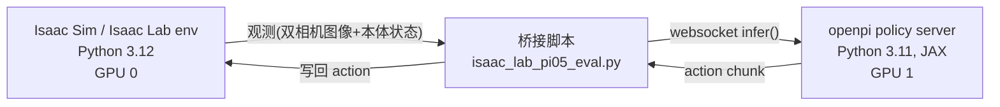

# Isaac Sim + Isaac Lab + pi0.5 (openpi) 仿真测试环境搭建技术文档

## 1. 目标与背景

在本机（Ubuntu 22.04，双 NVIDIA RTX 5080，驱动 580.126.20 / CUDA 13.0，无 docker）部署 NVIDIA Isaac Sim 仿真平台，并接入 Physical Intelligence 开源的 pi0.5 VLA（Vision-Language-Action）模型（[openpi](https://github.com/Physical-Intelligence/openpi) 仓库），完成一次端到端仿真闭环测试：Isaac Lab 提供的机械臂 manipulation 任务 → 采集双相机图像与本体状态 → 通过 openpi 的 websocket policy server 获得动作 → 写回仿真环境执行。

调研阶段确认的关键约束：

- Isaac Sim 的 pip 包（当前最新 6.0.1.0）要求 **Python 3.12**，与本机默认 Python 3.10.12 不兼容。
- openpi 官方**没有**提供 Isaac Sim / Isaac Lab 集成，只有 LIBERO 的官方 eval 集成；openpi 依赖 JAX 0.5.3 (CUDA 12 wheel) + PyTorch 2.7.1，与 Isaac Sim 自带的 Kit/PhysX CUDA 栈直接混装风险很高。
- RTX 5080（Blackwell，`sm_120`）对 Isaac Sim 的官方兼容性文档未明确提及，需要实测验证。

因此采用**两个独立 Python 环境 + client-server 桥接**的方案：Isaac Sim/Isaac Lab 运行在一个 3.12 环境里负责仿真渲染，openpi 运行在另一个 3.11 环境里通过 websocket 提供 pi0.5 推理服务，两者互不干扰依赖版本。



## 2. 环境搭建

### 2.1 Python 版本管理

使用 `uv` 直接下载所需 Python 版本，无需 apt/sudo：

```bash
mkdir -p ~/sim_stack && cd ~/sim_stack
uv venv isaac_sim_env --python 3.12   # Isaac Sim / Isaac Lab
uv venv openpi_env --python 3.11      # openpi 要求的版本（见其 .python-version）
```

### 2.2 安装 Isaac Sim（pip 方式）

```bash
source ~/sim_stack/isaac_sim_env/bin/activate
uv pip install "isaacsim[all,extscache]==6.0.1.0" \
    --extra-index-url https://pypi.nvidia.com \
    --index-strategy unsafe-best-match \
    --prerelease allow
```

**踩坑记录：**

| 问题 | 原因 | 解决 |
|---|---|---|
| `isaacsim[all]` 无法解析（`mujoco-usd-converter` 版本冲突） | uv 默认只从"首个包含该包的 index"取版本，导致跨 index 的传递依赖解析失败 | 显式指定版本 `==6.0.1.0`，加 `--index-strategy unsafe-best-match` |
| 加了 `unsafe-best-match` 后又解析到旧版 `5.0.0.0` 并因 `isaacsim-robot-setup` 找不到 wheel 而构建失败 | resolver 在允许跨 index 匹配后选择了不匹配当前 Python ABI 的旧版本 | 保留显式版本号 `==6.0.1.0` 即可锁定 |
| `tinyobjloader==2.0.0rc13` 无法安装 | 该依赖是预发布版本，默认被 uv 拒绝 | 加 `--prerelease allow` |
| `import isaacsim` 卡住等待输入 | 首次运行需要交互式同意 Omniverse EULA | 设置环境变量 `OMNI_KIT_ACCEPT_EULA=YES`，或首次手动同意一次 |

安装完成后自动匹配到本机 CUDA 13 驱动，装的是 `torch==2.11.0`（cu13 系列）及一整套 `nvidia-cu13-*` 包。

**Headless 启动验证**（确认 RTX 5080/Blackwell 兼容性）：

```python
from isaacsim.simulation_app import SimulationApp
app = SimulationApp({"headless": True})
import omni.physx
app.close()
```

结果：Warp 1.13.0 正确识别双卡 `"NVIDIA GeForce RTX 5080" (15 GiB, sm_120, mempool enabled)`，PhysX/CUDA 初始化无报错。**结论：Isaac Sim 6.0.1.0 对 RTX 5080 (Blackwell) 支持良好，本次任务中未发现渲染器/物理引擎层面的架构级兼容性问题**（后续遇到的相机崩溃最终定位为显存不足，见 §4）。

### 2.3 安装 Isaac Lab

Isaac Lab 是构建在 Isaac Sim 之上的机器人学习框架（RL/IL 环境、任务套件），Isaac Sim 本身只是渲染器/物理引擎，不含 gym 风格的任务层，因此需要额外安装。

```bash
cd ~/sim_stack && git clone https://github.com/isaac-sim/IsaacLab.git
cd IsaacLab
git checkout release/3.0.0-beta2   # 关键：需匹配 Isaac Sim 版本
source ~/sim_stack/isaac_sim_env/bin/activate
./isaaclab.sh --install
```

**踩坑记录：** IsaacLab 的 `main` 分支 README 标注对应 **Isaac Sim 5.1.0**，直接装会在导入 `isaaclab_tasks` 时报 `ModuleNotFoundError: No module named 'omni.physics.tensors.impl'`（Isaac Sim 6.0 的内部模块路径已变化）。排查发现 `release/3.0.0-beta2` 分支明确标注 **IsaacSim 6.0.1 + Python 3.12**，与已安装版本完全匹配，切换分支后重装即解决。

验证任务环境注册成功（示例）：

```
Isaac-Stack-Cube-Franka-IK-Rel-Visuomotor-v0   # 双相机 + IK-relative 动作，本次测试选用
Isaac-Lift-Cube-Franka-v0
Isaac-Reach-Franka-v0
... 等 60+ manipulation/dexsuite 任务
```

**资产路径 bug 修复：** 首次跑该任务时报 `FileNotFoundError`，USD 资产 URL 404：

```
https://omniverse-content-production.s3-us-west-2.amazonaws.com/Assets/Isaac/6.0/Isaac/IsaacLab/Robots/FrankaEmika/panda_instanceable.usd
```

通过 S3 ListBucket API 排查，确认 6.0 版资产库中该文件已被移动到 `Legacy/` 子目录（`beta` 分支资产迁移滞后导致的路径不一致）。修复：

```python
# source/isaaclab_assets/isaaclab_assets/robots/franka.py
usd_path=f"{ISAACLAB_NUCLEUS_DIR}/Robots/FrankaEmika/Legacy/panda_instanceable.usd",
```

### 2.4 安装 openpi（pi0.5）

```bash
cd ~/sim_stack && git clone https://github.com/Physical-Intelligence/openpi
cd openpi
UV_PROJECT_ENVIRONMENT=~/sim_stack/openpi_env uv sync
```

`uv sync` 按其 `pyproject.toml`/`uv.lock` 精确安装（`jax[cuda12]==0.5.3`、`torch==2.7.1`、`transformers==4.53.2` 等），并验证双 GPU 可见：

```python
import jax; jax.devices()        # [CudaDevice(id=0), CudaDevice(id=1)]
import torch; torch.cuda.is_available()  # True
```

### 2.5 桥接依赖：openpi-client 装入 Isaac Sim 环境

`openpi_client` 包（websocket 客户端 + 图像预处理工具）体积小，但其 `pyproject.toml` 要求 `numpy<2.0.0`，而 Isaac Sim/Isaac Lab 生态强依赖 `numpy>=2.x`。用 `--no-deps` 方式单独装入 Isaac Sim 环境，避免破坏其 numpy 版本：

```bash
source ~/sim_stack/isaac_sim_env/bin/activate
uv pip install --no-deps -e ~/sim_stack/openpi/packages/openpi-client
```

## 3. 下载 pi0.5-LIBERO checkpoint 并启动 policy server

```bash
source ~/sim_stack/openpi_env/bin/activate
cd ~/sim_stack/openpi
python scripts/serve_policy.py --env LIBERO --port <PORT>
```

- 首次运行自动从 `gs://openpi-assets/checkpoints/pi05_libero` 下载 checkpoint（约 11.6 GiB），及 PaliGemma tokenizer。
- **注意端口冲突**：这是一台多用户共享机器，默认端口 8000 已被其他用户的 `http.server` 占用，8765 也被占用；改用随机高位端口（如 31437）避免影响其他用户进程。
- server 加载完成后日志显示 `server listening on 0.0.0.0:<PORT>`，模型常驻显存提供 websocket 推理服务。

## 4. Isaac Lab ↔ openpi 桥接脚本

脚本位置：`~/sim_stack/bridge/isaac_lab_pi05_eval.py`（运行在 `isaac_sim_env`）。

设计参照 openpi 官方 LIBERO eval 脚本（`examples/libero/main.py`）的 client-server 模式：

1. 用 `resolve_task_config` + `launch_simulation`（Isaac Lab 标准 boilerplate）起一个 `Isaac-Stack-Cube-Franka-IK-Rel-Visuomotor-v0` 环境（Franka 机械臂堆叠方块任务，自带 `table_cam` / `wrist_cam` 两路 RGB 相机 + 本体关节/末端位姿观测）。
2. 每步把 `table_cam`（第三人称）、`wrist_cam`（腕部视角）图像 resize+pad 到 224×224，连同末端位姿状态和文本 prompt 一起打包成 openpi 标准的 obs dict：
   ```python
   {"observation/image": ..., "observation/wrist_image": ..., "observation/state": ..., "prompt": ...}
   ```
3. 通过 `openpi_client.websocket_client_policy.WebsocketClientPolicy.infer()` 请求 pi0.5 server，得到一个 action chunk，每 `--replan_steps` 步重新查询一次模型（chunk 内其余动作直接执行，减少推理频率）。
4. 动作写回 `env.step()`，推进仿真；记录每个 episode 的双相机原始帧序列，结束后用 `imageio` 拼接保存为 mp4（`table_cam` 与 `wrist_cam` 左右拼接）。

关键 CLI 参数：`--task` `--host` `--port` `--prompt` `--replan_steps` `--num_episodes` `--max_steps` `--resize_size` `--video_out_path`。

### 4.1 调试过程中的问题与修复

**(a) Headless 下卡死（约 20 分钟无输出，CPU 占用 ~2900% 但 GPU 利用率仅 1%）**

原因：脚本沿用了 Isaac Lab 示例脚本 `random_agent.py` 的写法 `parser.set_defaults(visualizer=["kit"])`。Isaac Lab 的 `--visualizer`/`--viz` 参数默认应为 `None`（省略即为无头运行），显式请求 `kit` 可视化器在没有显示设备的机器上会导致渲染/可视化初始化陷入忙等。

排查方法：先用 Isaac Lab 官方 `scripts/environments/zero_agent.py`（不接 openpi）单独复现，确认是 Isaac Lab 视化器配置问题而非桥接逻辑或环境本身的 bug。

修复：桥接脚本不再设置 `visualizer` 默认值，直接使用 `--headless` + 显式传 `--visualizer none`。

**(b) 相机观测读取时 CUDA 崩溃（`Warp CUDA error 700: illegal memory access`，随后级联 `PhysX error: Failed to unload CUDA module`、进程 core dump）**

初步怀疑是 RTX 5080 (Blackwell) 与 Isaac Lab 相机渲染管线（tiled rendering）的架构级兼容性问题。排查步骤：

1. 用不带相机的 `Isaac-Reach-Franka-v0` 任务测试 60 秒无异常 → 确认基础物理仿真稳定，问题限定在相机传感器路径。
2. 用纯 Isaac Sim（不经 Isaac Lab）脚本单独测试相机初始化/读取 → 未崩溃，确认非 Isaac Sim 核心 bug。
3. 用 `zero_agent.py` 复现该相机任务，观察到错误日志中出现 `Out of GPU memory allocating resource ... VkResult: ERROR_OUT_OF_DEVICE_MEMORY` → **真正原因**：openpi 的 JAX policy server 默认在两张 GPU 上各预分配约 12 GB 显存（JAX 默认策略），导致 Isaac Sim 的 RTX 渲染器申请显存失败，进而级联触发 CUDA context 损坏和崩溃。

修复：将 policy server 限定到单张 GPU，并限制 JAX 显存预分配比例，把另一张 GPU 完全留给 Isaac Sim 渲染：

```bash
CUDA_VISIBLE_DEVICES=1 XLA_PYTHON_CLIENT_MEM_FRACTION=0.5 \
    python scripts/serve_policy.py --env LIBERO --port <PORT>
```

修复后 GPU 0 显存占用降为 ~100 MiB（完全空闲），GPU 1 仅占用约 8 GiB，Isaac Lab 相机任务不再崩溃。**结论：这不是 Blackwell 架构兼容性问题，是双进程共享双 GPU 时的显存竞争问题。**

## 5. 端到端运行结果

```bash
source ~/sim_stack/isaac_sim_env/bin/activate
cd ~/sim_stack/IsaacLab
python ~/sim_stack/bridge/isaac_lab_pi05_eval.py \
    --task Isaac-Stack-Cube-Franka-IK-Rel-Visuomotor-v0 \
    --port 31437 --prompt "stack the cubes" \
    --num_episodes 1 --max_steps 60 --headless \
    --video_out_path ~/sim_stack/videos
```

输出：

```
[INFO]: Gym observation space: Dict('policy': Dict(..., 'table_cam': Box(-inf, inf, (1, 200, 200, 3), float32), 'wrist_cam': Box(-inf, inf, (1, 200, 200, 3), float32)), ...)
[INFO]: Gym action space: Box(-inf, inf, (1, 7), float32)
[episode 0] steps=60 success=False
Success rate: 0/1
```

- 双相机（`table_cam` + `wrist_cam`）图像观测 + 机械臂本体状态 → pi0.5 policy server 推理 → 7 维动作（6 维 IK 相对位姿 + 1 维夹爪）写回仿真，全程 60 步无报错、无崩溃。
- 未在 60 步内完成堆叠属预期内结果：pi0.5-LIBERO 是在 LIBERO 基准数据上训练/评测的通用 checkpoint，未针对 Isaac Lab 这个具体场景（不同的相机位姿、物体材质、机械臂控制接口）做过微调或数据对齐，零样本迁移下动作合理性有限。
- 生成视频：`~/sim_stack/videos/episode_0_failure_table_wrist.mp4`（table_cam 与 wrist_cam 左右拼接，10 fps）。

## 6. 环境清单

| 组件 | 路径 | Python | 说明 |
|---|---|---|---|
| Isaac Sim 6.0.1.0 | `~/sim_stack/isaac_sim_env` | 3.12 | pip 安装，GPU 0 用于渲染 |
| Isaac Lab | `~/sim_stack/IsaacLab`（`release/3.0.0-beta2` 分支） | 3.12（同上环境） | 已修复 franka 资产路径 |
| openpi + pi0.5-libero checkpoint | `~/sim_stack/openpi_env` | 3.11 | policy server 跑在指定端口，限定 GPU 1 |
| openpi-client | 装入 `isaac_sim_env`（`--no-deps`） | 3.12 | 仅用于 websocket 通信，避免 numpy 版本冲突 |
| 桥接脚本 | `~/sim_stack/bridge/isaac_lab_pi05_eval.py` | 3.12 | Isaac Lab env ↔ pi0.5 server |
| checkpoint 缓存 | `~/.cache/openpi/openpi-assets/checkpoints/pi05_libero` | - | 约 11.6 GiB |
| 输出视频 | `~/sim_stack/videos/` | - | 双相机拼接 mp4 |

## 7. 如何用 Isaac Sim / Isaac Lab 做仿真

### 7.1 两种运行入口

Isaac Sim 提供两个层次的 API，Isaac Lab 是构建在其上的任务/学习框架：

- **纯 Isaac Sim（底层 API）**：直接控制 `SimulationApp`、USD stage、prim，适合搭自定义场景或做最小化调试（本次调试相机崩溃问题时用到，见 §4.1(b) 排查步骤 2）：
  ```python
  from isaacsim.simulation_app import SimulationApp
  app = SimulationApp({"headless": True})   # 必须最先创建，之后才能 import omni.* / isaaclab
  import omni.usd
  from isaacsim.sensors.camera import Camera
  # ... 搭场景 / 加相机 / app.update() 推进仿真 ...
  app.close()
  ```
- **Isaac Lab（gym 任务层）**：本次任务采用的方式，通过 `gymnasium.make(task_id)` 直接拿到一个标准 gym 环境，不需要手写 USD 场景搭建逻辑。**推荐用于 manipulation / RL / IL 任务**，因为传感器、随机化、终止条件、奖励等都已经封装好。

### 7.2 Isaac Lab 标准脚本骨架

Isaac Lab 脚本有固定的 boilerplate（`scripts/environments/zero_agent.py`、`random_agent.py` 等官方示例都是这个模式，本次桥接脚本 `isaac_lab_pi05_eval.py` 也照此结构）：

```python
import argparse, sys
import gymnasium as gym
import isaaclab_tasks  # noqa: F401  -- 触发所有任务的 gym.register()
from isaaclab_tasks.utils import add_launcher_args, launch_simulation, resolve_task_config, setup_preset_cli

parser = argparse.ArgumentParser()
parser.add_argument("--task", type=str, required=True)
add_launcher_args(parser)   # 注入 --headless / --device / --visualizer 等标准仿真启动参数
args_cli, hydra_args = setup_preset_cli(parser)
sys.argv = [sys.argv[0]] + hydra_args

env_cfg, _ = resolve_task_config(args_cli.task, "")   # 按 --task 解析出对应的环境配置类
with launch_simulation(env_cfg, args_cli):            # 上下文管理器：启动/关闭 SimulationApp
    env_cfg.scene.num_envs = 1                         # 可在起环境前覆盖配置（并行环境数、设备等）
    env = gym.make(args_cli.task, cfg=env_cfg)
    obs, _ = env.reset()
    action = ...                                       # 形状为 (num_envs, action_dim) 的 tensor
    obs, reward, terminated, truncated, info = env.step(action)
    env.close()
```

**关键点/坑：**

- `--headless` 场景下**不要**显式设置 `--visualizer kit`（也不要在代码里 `set_defaults(visualizer=["kit"])`），否则会在无显示设备的机器上死循环挂起（见 §4.1(a)）。多机无头服务器上省略 `--visualizer` 参数即可。
- `env.step(action)` 的 `action` 必须是 `(num_envs, action_dim)` 形状的 torch tensor，且要在 `torch.inference_mode()` 上下文里跑（省显存、跳过 autograd 记录）。
- `obs` 是嵌套 dict：`obs["policy"]` 是策略可见的所有观测项（本次任务里含 `table_cam`/`wrist_cam` 图像 + `joint_pos`/`eef_pos` 等状态），键名和维度由 `ObservationsCfg`（任务配置类里定义）决定，运行时用 `env.observation_space` 可以直接打印出来核对。

### 7.3 查看/选择可用任务

```bash
source ~/sim_stack/isaac_sim_env/bin/activate
python -c "
from isaacsim.simulation_app import SimulationApp
app = SimulationApp({'headless': True})
import gymnasium as gym, isaaclab_tasks
for k in sorted(gym.registry.keys()):
    if 'Isaac' in k: print(k)
app.close()
"
```

任务命名规律：`Isaac-<任务名>-<机器人>-<控制模式>-v0`，例如 `Isaac-Stack-Cube-Franka-IK-Rel-Visuomotor-v0` = 堆方块任务 + Franka 机械臂 + IK 相对位姿控制 + 带视觉（相机）观测。不带 `Visuomotor` 的同名任务通常只有低维状态观测，没有相机，调试基础物理/动作接口时更快更稳定（见 §4.1(b) 排查步骤 1 的做法）。

### 7.4 GPU 资源规划（多进程共享 GPU 时）

若需要 Isaac Sim 仿真和另一个占显存的进程（如 pi0.5 policy server）共存，务必显式规划 GPU 分配，否则会出现 §4.1(b) 描述的显存竞争崩溃：

- 用 `CUDA_VISIBLE_DEVICES=<N>` 把两个进程分别绑定到不同物理 GPU。
- 若对方是 JAX 进程，额外用 `XLA_PYTHON_CLIENT_MEM_FRACTION=<0~1>` 限制其显存预分配比例（JAX 默认预分配 75%）。
- 用 `nvidia-smi --query-gpu=index,memory.used,memory.total --format=csv` 实时核对两边显存占用，确认 Isaac Sim 所在 GPU 有足够余量（相机渲染 + PhysX + Warp kernel 至少需要几 GB 空闲）。

## 8. 如何对 pi0.5 进行推理

### 8.1 推理的两种形态

pi0.5（openpi 里对应的模型族是 `Pi0Config(pi05=True)`）支持两种推理方式，本次任务用的是 (b)：

**(a) 进程内直接调用**（适合脚本化批量评测、不需要跨语言/跨进程）：

```python
from openpi.training import config as _config
from openpi.policies import policy_config as _policy_config

config = _config.get_config("pi05_libero")   # 训练配置名，决定模型结构/数据处理方式
policy = _policy_config.create_trained_policy(config, "gs://openpi-assets/checkpoints/pi05_libero")
# 或指向本地下载/微调后的 checkpoint 目录，如 "checkpoints/pi05_libero/my_experiment/20000"

example = {
    "observation/image": rgb_uint8_hw3,          # 第三人称相机，224x224x3 uint8
    "observation/wrist_image": wrist_rgb_uint8,  # 腕部相机
    "observation/state": proprio_vec,            # 末端位姿/关节角等本体状态
    "prompt": "stack the cubes",                  # 自然语言指令
}
action_chunk = policy.infer(example)["actions"]  # 返回未来若干步的动作序列 (horizon, action_dim)
```

**(b) 常驻 policy server + websocket client**（本次采用，适合仿真/机器人运行时与模型推理解耦到不同进程/环境）：

```bash
# 服务端（openpi_env，Python 3.11，含 JAX/PyTorch）
python scripts/serve_policy.py --env LIBERO --port <PORT>
# 或指定具体 checkpoint：
python scripts/serve_policy.py policy:checkpoint --policy.config=pi05_libero --policy.dir=<ckpt_dir> --port <PORT>
```

```python
# 客户端（可以是任意 Python 版本/环境，只需要轻量的 openpi_client 包）
from openpi_client import websocket_client_policy
client = websocket_client_policy.WebsocketClientPolicy(host, port)
action_chunk = client.infer(example)["actions"]   # 与 policy.infer() 接口一致
```

两种方式的 `example` dict 结构、`infer()` 返回结构完全一致，区别只在于是否跨进程。本次桥接脚本 `isaac_lab_pi05_eval.py` 用的正是 (b)，因为 Isaac Sim 环境（Python 3.12 + numpy 2.x）和 openpi 环境（Python 3.11 + JAX + numpy<2.0）依赖冲突严重，无法共享同一进程（见 §2.5）。

### 8.2 动作分块（action chunking）与 replan

pi0.5 每次 `infer()` 返回的是**一段动作序列**（action chunk，比如未来 10 步），而不是单步动作，这是 VLA 类模型常见设计（降低推理频率、增强动作平滑性）。典型消费模式（`examples/libero/main.py` 和本次桥接脚本都遵循此模式）：

```python
action_plan = collections.deque()
...
if not action_plan:                                   # chunk 用完了才重新推理
    action_chunk = client.infer(element)["actions"]
    action_plan.extend(action_chunk[:replan_steps])   # 只取前 replan_steps 步，不用满整个 chunk
action = action_plan.popleft()
env.step(action)
```

`replan_steps` 越小，越接近"每步都重新观测决策"（更能响应环境变化，但推理调用更频繁）；越大则越省推理开销，但对环境突变的响应会滞后。

### 8.3 观测预处理注意事项

- 图像需要用 `openpi_client.image_tools.resize_with_pad` 缩放到模型训练时的分辨率（pi0.5-LIBERO 是 224×224），并 `convert_to_uint8`；直接传原始分辨率/浮点图像会导致模型输入分布偏移。
- `observation/state` 的维度和物理含义必须和训练数据处理方式（`LiberoInputs`/`LiberoOutputs` 或你自定义的 policy 输入输出映射类）严格对应，比如 pi0.5-LIBERO 期望的是 `[eef_pos(3), eef_axis_angle(3), gripper_qpos(2)]` 拼接的 8 维向量。跨平台迁移（如本次从 LIBERO 迁移到 Isaac Lab）时，如果状态定义不完全一致，会导致零样本效果打折扣（本次任务里就是简化为 `eef_pos` 3 维，是精度损失的一个已知点，可在后续优化中对齐补全）。
- `prompt` 是纯自然语言字符串，模型内部走 PaliGemma tokenizer 编码，不需要额外处理。

## 9. 如何对 pi0.5 进行微调

### 9.1 硬件门槛（来自 openpi 官方 README）

| 模式 | 显存需求 | 参考 GPU |
|---|---|---|
| 推理 | > 8 GB | RTX 4090 |
| LoRA 微调 | > 22.5 GB | RTX 4090 |
| 全量微调 | > 70 GB | A100(80G) / H100 |

本机双 RTX 5080（各 16GB）单卡跑**全量微调会显存不足**，可以跑 **LoRA 微调**（若使用 JAX 版本；PyTorch 版本目前暂不支持 LoRA，见 §9.4）。

### 9.2 微调三步流程（JAX 版本，官方推荐路径）

**第一步：把自己的数据转换成 LeRobot 数据集格式**

openpi 训练管线统一吃 [LeRobot](https://github.com/huggingface/lerobot) 格式数据。以 LIBERO 为例的转换脚本可以直接改造成适配自己数据的版本：

```bash
uv run examples/libero/convert_libero_data_to_lerobot.py --data_dir /path/to/your/data
```

如果只是想在 LIBERO 数据集上复现微调（不需要自己采集数据），可跳过此步——`pi05_libero` 训练配置已经指向一个预转换好的 LIBERO LeRobot 数据集。

**第二步：定义训练配置并计算归一化统计量**

在 `src/openpi/training/config.py` 里找到已有的 `pi05_libero` 等配置作为模板，核心要素三件套：

- `<Task>Inputs` / `<Task>Outputs`（如 `src/openpi/policies/libero_policy.py` 里的 `LiberoInputs`/`LiberoOutputs`）：定义你的环境观测/动作 ↔ 模型输入输出之间的映射关系（哪些相机对应哪个 key、state 怎么拼、action 怎么解）。**这一步是迁移到新场景/新机器人时必须自己写的部分**，本次 Isaac Lab 集成如果要微调，需要对着 `Isaac-Stack-Cube-Franka-IK-Rel-Visuomotor-v0` 的实际观测/动作定义写一个新的 `Inputs`/`Outputs` 类。
- `<Task>DataConfig`（如 `LeRobotLiberoDataConfig`）：定义如何从 LeRobot 数据集读取/预处理原始数据喂给上面的 Inputs 类。
- `TrainConfig`：整合以上两者 + 超参数（batch size、学习率、训练步数）+ `weight_loader`（指定从哪个 base checkpoint 加载初始权重，如 `gs://openpi-assets/checkpoints/pi05_base`）。

配置写好、注册到 `_CONFIGS` 列表后，先算归一化统计量（训练前必须执行一次，否则会报 `Missing norm stats` 错误）：

```bash
uv run scripts/compute_norm_stats.py --config-name <your_config_name>
```

**第三步：启动训练**

```bash
XLA_PYTHON_CLIENT_MEM_FRACTION=0.9 uv run scripts/train.py <your_config_name> --exp-name=my_experiment --overwrite
```

- `--overwrite`：重跑同一 config 名字时覆盖旧 checkpoint 目录。
- `XLA_PYTHON_CLIENT_MEM_FRACTION=0.9`：尽量吃满显存加速训练；但**如果同一台机器上还要同时跑 Isaac Sim 仿真（比如做 on-policy 数据采集或边训边评），务必调低这个比例**，参照 §4.1(b) 的教训，否则会造成显存竞争导致仿真侧崩溃。
- 训练日志输出到终端，同时可选接入 Weights & Biases 看板；checkpoint 默认存到 `checkpoints/<config_name>/<exp_name>/<step>/` 下。
- 如果是在预训练数据分布内的机器人平台上做小任务微调，可以复用预训练阶段的归一化统计量而不是重新计算，细节见官方 `docs/norm_stats.md`。

**第四步：用微调后的 checkpoint 起 policy server 做推理**

```bash
uv run scripts/serve_policy.py policy:checkpoint \
    --policy.config=<your_config_name> \
    --policy.dir=checkpoints/<your_config_name>/my_experiment/20000
```

后续接入方式和 §8 完全一致（本次桥接脚本 `isaac_lab_pi05_eval.py` 无需任何改动，只要把 `--port` 指向这个新 server 即可）。

### 9.3 结合本次 Isaac Lab 集成微调的建议路径

本次端到端测试用的是零样本迁移的 `pi05_libero` 通用 checkpoint，直接喂 Isaac Lab 场景效果有限（见 §5）。如果要提升到该任务上的实际成功率，建议流程：

1. 用桥接脚本的日志采集/或专门写一个数据采集脚本，在 `Isaac-Stack-Cube-Franka-IK-Rel-Visuomotor-v0` 环境里跑若干条**人类遥操作或脚本策略生成的成功轨迹**，按 LeRobot 格式保存（图像、状态、动作、语言指令）。
2. 参照 §9.2 第二步，写一个 `IsaacLabStackInputs`/`IsaacLabStackOutputs` 映射类，对齐本次桥接脚本里手工拼的观测格式（`table_cam`/`wrist_cam`/`eef_pos` 等）。
3. 以 `pi05_base`（而不是 `pi05_libero`）为 `weight_loader` 起点做微调，避免继承 LIBERO 特定的语言/视觉分布偏置。
4. 微调后用本次已跑通的桥接脚本直接评测，只需切换 `--port` 指向新 server，无需改仿真侧代码。

### 9.4 PyTorch 版本的差异

openpi 同时提供 PyTorch 实现（已在 LIBERO 上验证推理+微调），接口与 JAX 版一致，但目前**不支持**：π₀-FAST 模型、混合精度训练、FSDP、**LoRA**、EMA 权重。若必须用 LoRA 节省显存，需用 JAX 版本；若更看重生态兼容性（PyTorch 生态工具链）且显存充足支持全量微调，可考虑 PyTorch 版：

```bash
# 1. JAX checkpoint 转 PyTorch 格式
uv run examples/convert_jax_model_to_pytorch.py \
    --config_name <config_name> --checkpoint_dir /path/to/jax/ckpt --output_path /path/to/pytorch/ckpt

# 2. 打 transformers 库补丁（一次性，注意会影响 uv 全局缓存，见官方 README 警告）
cp -r ./src/openpi/models_pytorch/transformers_replace/* .venv/lib/python3.11/site-packages/transformers/

# 3. 训练 / serve_policy.py 命令与 JAX 版一致，只是 checkpoint 目录指向转换后的 PyTorch 权重
```

## 10. 用 Isaac Lab 做强化学习训练（以四足机械狗运动为例）

本次任务主线是 pi0.5 的模仿学习/VLA 仿真评测（§7~§9），但 Isaac Lab 本身也是一个成熟的 RL 训练框架，内置了大量足式机器人运动（locomotion）任务，包括 Unitree Go1/Go2/A1、ANYmal B/C/D、Cassie、Digit、Unitree H1/G1 人形等。以下以 **Unitree Go2 机械狗速度跟踪运动**为例，记录实测跑通的训练流程。

### 10.1 支持的 RL 训练库

`release/3.0.0-beta2` 分支把各 RL 库的训练脚本统一到了一个入口，通过 `--rl_library` 选择：

```bash
./isaaclab.sh train --rl_library <rl_games|rsl_rl|sb3|skrl|rlinf> --task <TASK_ID> [选项...]
./isaaclab.sh play  --rl_library <同上>                              --task <TASK_ID> [选项...]
```

（旧版本 `scripts/reinforcement_learning/<lib>/train.py` 的调用方式已标记 deprecated，会打印警告并提示改用上面的统一入口；`isaaclab_lab` 环境里已经带有 `rsl-rl-lib`、`rl-games`、`skrl`、`stable-baselines3` 等库，安装 Isaac Lab 时随 `./isaaclab.sh --install` 一起装好，见 §2.3。）

机械狗运动任务官方默认推荐用 **rsl_rl**（NVIDIA/ETH 维护的 PPO 实现，专为 legged locomotion 优化），本节以此为例。

### 10.2 可用的机械狗/足式运动任务

```bash
source ~/sim_stack/isaac_sim_env/bin/activate
python -c "
from isaacsim.simulation_app import SimulationApp
app = SimulationApp({'headless': True})
import gymnasium as gym, isaaclab_tasks
for k in sorted(gym.registry.keys()):
    if 'Velocity' in k: print(k)
app.close()
"
```

命名规律：`Isaac-Velocity-<Flat|Rough>-<机器人>-v0`（还有对应的 `-Play-v0` 版本用于评测/可视化，通常环境数更少、去掉了训练时的域随机化）。以 Go2 为例：

| 任务 ID | 说明 |
|---|---|
| `Isaac-Velocity-Flat-Unitree-Go2-v0` | 平地速度跟踪，训练用 |
| `Isaac-Velocity-Flat-Unitree-Go2-Play-v0` | 平地速度跟踪，评测/播放用 |
| `Isaac-Velocity-Rough-Unitree-Go2-v0` | 起伏地形速度跟踪（更难），训练用 |
| `Isaac-Velocity-Rough-Unitree-Go2-Play-v0` | 起伏地形，评测/播放用 |

同样模式适用于 `Anymal-B/C/D`、`Cassie`、`Digit`、`H1`、`G1`、`A1`、`Spot` 等，把 `Go2` 换成对应机器人名即可。

### 10.3 任务的强化学习设计（以 velocity locomotion 为例）

Isaac Lab 的 `ManagerBasedRLEnv` 把 RL 任务的各个组件拆成独立的 manager，locomotion 任务的典型设计（定义在 `source/isaaclab_tasks/isaaclab_tasks/manager_based/locomotion/velocity/velocity_env_cfg.py`，各机器人在 `config/<robot>/` 下继承并覆写细节）：

- **观测（Observations）**：机身线速度/角速度、重力投影、速度指令（要跟踪的目标 x/y/yaw 速度）、关节位置/速度、上一步动作等，全部是低维状态（不含相机，训练速度快）。
- **动作（Actions）**：直接输出各关节的目标位置（`JointPositionAction`），下层由 PD 控制器转成力矩。
- **奖励（Rewards，加权求和）**：核心是"是否精确跟踪目标速度指令"（`track_lin_vel_xy_exp`/`track_ang_vel_z_exp`，指数型奖励），配合一系列正则化惩罚项防止学出不自然的步态或损坏机身：`lin_vel_z_l2`（惩罚上下颠簸）、`ang_vel_xy_l2`（惩罚翻滚俯仰角速度）、`dof_torques_l2`/`dof_acc_l2`（惩罚过大力矩/加速度）、`action_rate_l2`（惩罚动作突变）、`feet_air_time`（鼓励合理步态节奏）、`flat_orientation_l2`（惩罚姿态倾斜）、`dof_pos_limits`（惩罚关节超限）等。
- **终止条件（Terminations）**：超时（`time_out`）、机身触地/摔倒（`base_contact`）。
- **域随机化（Events）**：随机化摩擦系数、质量、初始位姿、外部推力扰动等，提升 sim-to-real 迁移鲁棒性。
- **课程学习（Curriculum，Rough 任务）**：随训练进程逐步加大地形难度。

这一整套设计已经在任务配置类里写好，**训练机械狗运动通常不需要改代码，只需要选任务 + 调超参**。

### 10.4 启动训练

```bash
source ~/sim_stack/isaac_sim_env/bin/activate
cd ~/sim_stack/IsaacLab
./isaaclab.sh train --rl_library rsl_rl \
    --task Isaac-Velocity-Flat-Unitree-Go2-v0 \
    --headless \
    --num_envs 4096 \
    --max_iterations 300
```

**实测验证**（2 iteration 冒烟测试，`--num_envs 64`）：训练正常启动并完成迭代，日志输出符合预期：

```
Learning iteration 0/2
Total steps: 1536   Steps per second: 5720
Mean reward: -1.02
Episode_Reward/track_lin_vel_xy_exp: 0.0074   Episode_Reward/track_ang_vel_z_exp: 0.0025
...
Metrics/success_rate: 0.2917
Training time: 2.82 seconds
```

checkpoint 自动保存到 `logs/rsl_rl/<experiment_name>/<时间戳>/model_<iteration>.pt`（`experiment_name` 由任务对应的 `RslRlOnPolicyRunnerCfg` 定义，Go2 平地任务是 `unitree_go2_flat`）。

**关键参数：**

| 参数 | 作用 |
|---|---|
| `--task` | 任务 ID |
| `--num_envs` | 并行仿真环境数（GPU 并行采样，locomotion 任务无相机、显存开销小，通常可以开到几千甚至上万，直接决定采样吞吐） |
| `--max_iterations` | 训练迭代数，覆盖任务默认值（如 Go2 平地默认 300，起伏地形默认 1500，见 `agents/rsl_rl_ppo_cfg.py`） |
| `--headless` | 无头训练，服务器上训练必须加 |
| `--video` / `--video_length` / `--video_interval` | 训练过程中定期录制视频，便于不接显示器时观察学习进展 |
| `--seed` | 随机种子 |

超参数（学习率、PPO clip、网络结构、奖励权重等）定义在每个任务的 `config/<robot>/agents/rsl_rl_ppo_cfg.py` 里（`RslRlOnPolicyRunnerCfg` + `RslRlPpoAlgorithmCfg`），需要调参时直接改这个文件，或参照 §7.2 的 `resolve_task_config` 机制传等价的 hydra 覆盖参数。

### 10.5 评测/可视化训练结果

```bash
./isaaclab.sh play --rl_library rsl_rl \
    --task Isaac-Velocity-Flat-Unitree-Go2-Play-v0 \
    --headless --num_envs 4 \
    --checkpoint logs/rsl_rl/unitree_go2_flat/<时间戳>/model_<iteration>.pt \
    --video --video_length 200
```

**实测验证**：`[INFO]: Loading model checkpoint from: .../model_1.pt` 加载成功，视频输出到 `logs/rsl_rl/<experiment_name>/<时间戳>/videos/play/`。`play.py` 默认会持续渲染直到手动中断（无 `--video` 时在 headless 下没有自然退出点，属预期行为，脚本化评测建议加 `--video` 并用 `timeout` 包一层，或只跑固定步数后 `env.close()`）。

### 10.6 从头训练一个新的运动任务（简述）

如果标准任务列表里没有你要的机器人/地形/步态，大致改动路径：

1. 在 `source/isaaclab_assets` 里找到或添加对应机器人的 USD 资产配置（关节、执行器参数等，参照 `source/isaaclab_assets/isaaclab_assets/robots/unitree.py`）。
2. 在 `source/isaaclab_tasks/isaaclab_tasks/manager_based/locomotion/velocity/config/` 下新建一个机器人目录，参照 `go2/` 写 `<robot>_env_cfg.py`（继承 `LocomotionVelocityRoughEnvCfg`，替换机器人资产、调整观测/动作维度、按需调整奖励权重）和 `agents/rsl_rl_ppo_cfg.py`（PPO 超参、网络结构），再在 `__init__.py` 里 `gym.register` 新任务 ID。
3. 用 §10.4 的命令训练，用 §10.5 评测。

多数情况下只需要复用已有任务框架换资产/调参，不需要重写 RL 算法或环境交互逻辑。

## 11. 后续可选优化方向

- 扩大 `--num_episodes` / `--max_steps` 做更完整的成功率统计。
- 尝试 `Isaac-Stack-Cube-Franka-IK-Rel-Visuomotor-Cosmos-v0` 等其他 visuomotor 任务验证泛化性。
- 如需更高成功率，按 §9.3 建议路径采集场景数据并微调 pi0.5，而非直接零样本迁移。
- 若需要多环境并行加速数据采集/评测，可将 `env_cfg.scene.num_envs` 调大，并相应扩展桥接脚本对 batch 观测/动作的处理。
- 若需要机械狗/机械臂的 RL 策略作为 pi0.5 的对比基线或者数据采集脚本策略，可参考 §10 训练一个 locomotion/manipulation 的 RL 策略。

