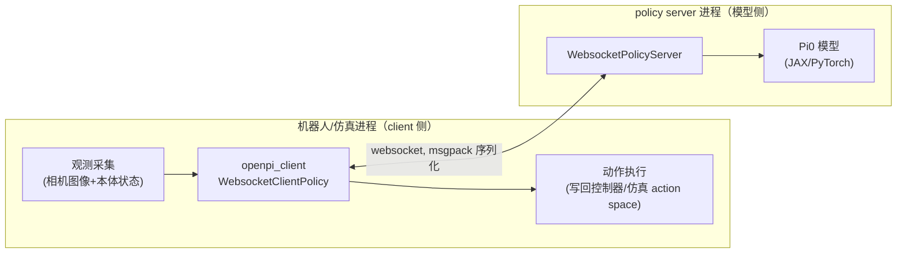
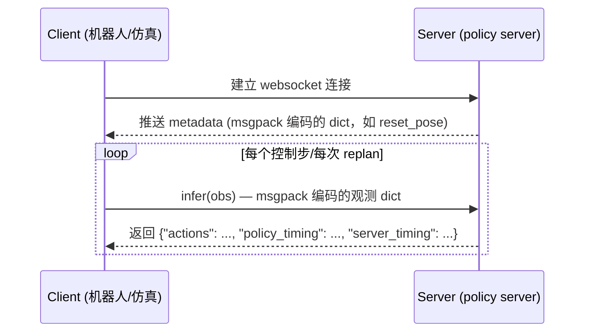

# pi0.5 部署、复现、推理、微调与通信实战手册

本文档聚焦 pi0.5（openpi 仓库）本身的关键使用场景：**checkpoint 复现、推理服务部署、网络通信协议、与真机通信、与仿真环境通信、微调**。所有内容均基于本机（Ubuntu 22.04，双 RTX 5080）的真实操作和 openpi 源码（`~/sim_stack/openpi`）走查，包含实际执行的命令和输出。

环境搭建、Isaac Sim 相关内容见 [`ISAAC_MANUAL.md`](./ISAAC_MANUAL.md)；本文档默认 `openpi_env`（Python 3.11）已装好，聚焦 pi0.5 这一侧。

## 目录

1. [整体通信架构](#1-整体通信架构)
2. [官方 checkpoint 复现：一次真实的端到端验证](#2-官方-checkpoint-复现一次真实的端到端验证)
3. [部署：启动 policy server 的几种方式](#3-部署启动-policy-server-的几种方式)
4. [网络通信协议详解](#4-网络通信协议详解)
5. [推理：观测约定与 Action Chunking](#5-推理观测约定与-action-chunking)
6. [与真机通信](#6-与真机通信)
7. [与仿真环境通信](#7-与仿真环境通信)
8. [微调](#8-微调)
9. [完整踩坑清单](#9-完整踩坑清单)
10. [速查命令模板](#10-速查命令模板)

---

## 1. 整体通信架构

pi0.5 采用 **policy server + client** 的架构，本质上是把"机器人/仿真环境跑什么"和"模型跑在哪、用什么框架推理"彻底解耦：



**为什么这么设计**（这不是我们的选择，是 openpi 官方架构，我们只是复用）：

- **依赖隔离**：模型侧需要 JAX/PyTorch + CUDA 这一整套重量级依赖；机器人/仿真侧代码应该尽量轻量（`openpi_client` 包本身只依赖 `msgpack`、`websockets`、`numpy` 这几个轻量库），不需要在机器人主控电脑或仿真环境里装 JAX。
- **算力分离**：模型推理可以放在一台有 GPU 的工作站/服务器上，机器人本体的计算单元（可能算力有限）只需要能维护 websocket 连接、做基本的图像 resize。
- **协议统一**：真机、仿真环境、LIBERO/ALOHA/DROID 各种官方 benchmark，全部走同一套 `observation dict → client.infer() → action dict` 协议，换后端（真机换仿真、仿真换真机）时，理论上只需要改"观测怎么采集""动作怎么执行"这两端的胶水代码，中间的模型调用代码完全不用动。

---

## 2. 官方 checkpoint 复现：一次真实的端到端验证

### 2.1 复现步骤

本次直接复用了此前已经跑起来的 pi0.5 policy server（进程常驻，未重启），验证方式：新开一个 client 进程，构造一份随机观测，调用 `infer()`，确认服务端能正常返回动作。

```bash
# 确认 server 进程仍在运行（GPU 1，端口 31437）
ps aux | grep serve_policy | grep -v grep
```

实际输出：

```
qingyu 3850369 ... python scripts/serve_policy.py --env LIBERO --port 31437
```

```bash
nvidia-smi --query-gpu=index,memory.used,memory.total --format=csv
```

```
index, memory.used [MiB], memory.total [MiB]
0, 103 MiB, 16303 MiB
1, 8311 MiB, 16303 MiB
```

GPU 1 上 8.3GB 显存占用，正是这个 pi0.5 LIBERO checkpoint 加载后的常驻显存占用。

### 2.2 最小复现脚本（不依赖任何仿真器/真机）

```python
import numpy as np
from openpi_client import websocket_client_policy as wcp
from openpi_client import image_tools

client = wcp.WebsocketClientPolicy(host="0.0.0.0", port=31437)
print("server metadata:", client.get_server_metadata())

img = np.random.randint(0, 255, (256, 256, 3), dtype=np.uint8)
wrist = np.random.randint(0, 255, (256, 256, 3), dtype=np.uint8)
obs = {
    "observation/image": image_tools.convert_to_uint8(image_tools.resize_with_pad(img, 224, 224)),
    "observation/wrist_image": image_tools.convert_to_uint8(image_tools.resize_with_pad(wrist, 224, 224)),
    "observation/state": np.zeros(8, dtype=np.float32),
    "prompt": "pick up the object",
}
result = client.infer(obs)
print("keys:", list(result.keys()))
print("actions shape:", np.array(result["actions"]).shape)
```

**实际输出**：

```
server metadata: {}
keys: ['actions', 'policy_timing', 'server_timing']
actions shape: (10, 7)
infer latency (s): 0.10596299171447754
```

复现成功，几个关键观察点：

- **`actions.shape == (10, 7)`**：`action_horizon=10`（不是 pi0.5 默认的 50！），`action_dim=7`。这是因为 `pi05_libero` 这个具体的 `TrainConfig`（见 `src/openpi/training/config.py:744`）显式覆盖了 `action_horizon=10`：

  ```python
  TrainConfig(
      name="pi05_libero",
      model=pi0_config.Pi0Config(pi05=True, action_horizon=10, discrete_state_input=False),
      ...
  )
  ```

  **教训**：`action_horizon` 不是全局固定为 50，而是每个具体 checkpoint 的训练配置决定的，写 client 代码时**不能硬编码假设 chunk 长度**，应该用 `len(action_chunk)` 动态判断（我们的桥接脚本 `isaac_lab_pi05_eval.py` 就是这么做的，见 `ISAAC_MANUAL.md` §6.3）。

- **`server metadata: {}`**：对 LIBERO 环境，server 没有返回任何元数据；而 ALOHA 真机场景下，`main.py` 会用 `metadata.get("reset_pose")` 拿复位姿态，说明 metadata 的内容是**按环境类型定制**的，不同 `--env` 启动的 server 返回的 metadata 结构不同，客户端代码要按目标环境去读对应字段，不能假设所有环境都有同一套 metadata。

- **推理延迟 ~106ms**：这是本地 loopback（client 和 server 在同一台机器上）的延迟，几乎是纯计算时间，真实网络场景（client 和 server 不在同一台机器）还要加上网络往返时延。这个数字是决定"控制频率上限"和"replan_steps 怎么设"的重要参考——如果你的控制回路要求 20Hz（50ms 一步），单次~106ms 的推理延迟意味着必须用 action chunking（一次推理执行多步）而不能每步都查询模型。

---

## 3. 部署：启动 policy server 的几种方式

### 3.1 用内置环境预设（最简单，本次实际使用的方式）

```bash
source ~/sim_stack/openpi_env/bin/activate
cd ~/sim_stack/openpi
CUDA_VISIBLE_DEVICES=1 XLA_PYTHON_CLIENT_MEM_FRACTION=0.5 \
    python scripts/serve_policy.py --env LIBERO --port 31437
```

`--env` 支持 `ALOHA` / `ALOHA_SIM` / `DROID` / `LIBERO` 这几个预设，每个预设在 `scripts/serve_policy.py` 里都对应一个固定的 `(config, checkpoint_dir)` 组合（比如 `LIBERO → config=pi05_libero, dir=gs://openpi-assets/checkpoints/pi05_libero`），选好 `--env` 就自动去对应的 GCS 路径下载 checkpoint（首次下载，之后走本地缓存 `~/.cache/openpi/`）。

### 3.2 用自定义 checkpoint（比如微调后的模型）

```bash
python scripts/serve_policy.py policy:checkpoint \
    --policy.config=pi05_libero \
    --policy.dir=/path/to/your/finetuned/checkpoint
```

- `--policy.config` 必须对应 `src/openpi/training/config.py` 里定义的某个 `TrainConfig.name`（决定模型结构：`action_horizon`、`pi05` 标志等），**这个字段决定的是"用什么结构去加载权重"，不是随便填的字符串**——如果这里填错（比如用了训练时不同的 config），模型结构和 checkpoint 权重形状不匹配，加载时会直接报错或者悄悄用错误的结构跑出无意义的输出。
- `--policy.dir` 是 checkpoint 目录，可以是本地路径，也可以是 `gs://` 云端路径（自动下载）。

### 3.3 GPU 资源隔离（必须做，见 §9 踩坑记录）

无论用哪种方式启动，都建议加上：

```bash
CUDA_VISIBLE_DEVICES=<专用卡号> XLA_PYTHON_CLIENT_MEM_FRACTION=<0~1之间>
```

- `CUDA_VISIBLE_DEVICES` 把 policy server 限定在一张卡上，避免和仿真渲染/其他 GPU 任务抢同一张卡。
- `XLA_PYTHON_CLIENT_MEM_FRACTION` 限制 JAX 的显存预分配比例（JAX 默认一次性预分配一张卡的大部分显存，即使模型本身用不了那么多），必须调小才能让同一张卡上其他进程（如果你选择共享卡）有显存可用。

### 3.4 端口

默认端口 8000，共享机器上容易冲突，建议先检查：

```bash
ss -tlnp | grep <端口号>
```

冲突就换一个随机高位端口（本次用的 31437）。

### 3.5 Docker 方式（官方也支持，未在本机实测）

`aloha_real`/`simple_client` 等示例目录下都带有 `Dockerfile`/`compose.yml`，官方推荐生产环境用 docker 隔离依赖；本机因为约束是"无 docker"，所以全程用 `uv venv` 隔离，效果等价（见 `ISAAC_MANUAL.md` §3 的环境隔离方案）。

---

## 4. 网络通信协议详解

pi0.5 的 client-server 协议非常薄，理解了它就能给任何机器人/仿真平台写 client 胶水代码。

### 4.1 传输层：WebSocket

`packages/openpi-client/src/openpi_client/websocket_client_policy.py` 的核心逻辑：

```python
class WebsocketClientPolicy(_base_policy.BasePolicy):
    def __init__(self, host="0.0.0.0", port=None, api_key=None):
        self._uri = f"ws://{host}" + (f":{port}" if port else "")
        self._packer = msgpack_numpy.Packer()
        self._ws, self._server_metadata = self._wait_for_server()

    def _wait_for_server(self):
        while True:
            try:
                headers = {"Authorization": f"Api-Key {self._api_key}"} if self._api_key else None
                conn = websockets.sync.client.connect(self._uri, compression=None, max_size=None, additional_headers=headers)
                metadata = msgpack_numpy.unpackb(conn.recv())
                return conn, metadata
            except ConnectionRefusedError:
                time.sleep(5)   # 服务端还没起来，重试等待

    def infer(self, obs: Dict) -> Dict:
        data = self._packer.pack(obs)
        self._ws.send(data)
        response = self._ws.recv()
        if isinstance(response, str):
            raise RuntimeError(f"Error in inference server:\n{response}")
        return msgpack_numpy.unpackb(response)
```

关键设计点：

- **连接时自带重试**：`_wait_for_server` 用一个 `while True` 循环等待服务端可用（每 5 秒重试一次），这意味着**client 可以先于 server 启动**，不需要严格的启动顺序控制——这对机器人/仿真场景很友好，你不用写额外的"等待 server ready"逻辑。
- **连接建立时服务端会先推一条 metadata 消息**：`conn.recv()` 拿到的第一条消息就是 metadata（不是动作！），`infer()` 里发的才是真正的观测/动作往返。如果你自己写一个新语言的 client（比如 C++/JS），**一定要记得先读一次 metadata 消息再进入推理循环**，漏掉这一步会导致后续所有消息错位。
- **错误处理约定**：正常响应是 `bytes`（msgpack 编码），如果服务端出错会发回一个 `str` 类型的消息（错误文本），client 侧用 `isinstance(response, str)` 来区分正常/异常响应——这是一个简单但容易忽略的协议细节：**服务端把"错误"和"正常结果"用 Python 类型本身来区分，而不是加一个专门的 status 字段**。
- **`compression=None, max_size=None`**：关闭 websocket 压缩（图像数据本身已经是二进制，压缩收益有限还增加 CPU 开销），且不限制消息大小（默认 websockets 库会限制单条消息大小，高分辨率图像/大 batch 容易超限，这里显式关闭限制）。
- **`api_key` 可选**：如果服务端配置了 API key 鉴权，client 通过标准 HTTP `Authorization: Api-Key <key>` header 传递，这是走公网/多用户共享 server 时的基本鉴权机制。

### 4.2 序列化格式：msgpack + numpy 扩展

标准 msgpack 不支持 numpy 数组，openpi 自己写了一层扩展（`msgpack_numpy.py`）：

```python
def pack_array(obj):
    if isinstance(obj, np.ndarray):
        return {b"__ndarray__": True, b"data": obj.tobytes(), b"dtype": obj.dtype.str, b"shape": obj.shape}
    if isinstance(obj, np.generic):
        return {b"__npgeneric__": True, b"data": obj.item(), b"dtype": obj.dtype.str}
    return obj

def unpack_array(obj):
    if b"__ndarray__" in obj:
        return np.ndarray(buffer=obj[b"data"], dtype=np.dtype(obj[b"dtype"]), shape=obj[b"shape"])
    if b"__npgeneric__" in obj:
        return np.dtype(obj[b"dtype"]).type(obj[b"data"])
    return obj
```

**为什么选 msgpack 而不是 JSON/pickle/protobuf**（源码注释里写明的原因，值得理解）：

- **安全性**：pickle 可以在反序列化时执行任意代码（反序列化攻击面），msgpack 不会，这对"接受未知 client 连接的网络服务"很重要。
- **无需 schema**：不像 protobuf/flatbuffers 需要预先定义 `.proto` 文件再编译，msgpack 可以直接序列化 Python dict/numpy 数组，适合 Python 这种动态类型语言快速迭代。
- **性能**：实测比 pickle 序列化大数组快 ~4 倍，比 JSON（纯文本，数值要转字符串）快得多。
- **跨语言**：msgpack 有各主流语言的实现，如果你的机器人主控代码是 C++/Rust 写的，也能用对应语言的 msgpack 库解析这套协议，不需要绑定 Python。

`pack_array`/`unpack_array` 的原理很直接：把 numpy 数组拆成"原始字节 + dtype 字符串 + shape 元组"三元组，用一个特殊 key（`__ndarray__`）标记这是一个数组而不是普通 dict，接收端按这个标记重建数组——本质上是手写的一层轻量二进制序列化协议，扩展在 msgpack 的 `default`/`object_hook` 钩子上。

### 4.3 完整消息往返时序



`policy_timing`/`server_timing` 字段（本次复现实测响应里确实包含）可以用来分离"模型前向计算耗时"和"包括网络/序列化在内的总耗时"，排查延迟问题时很有用——如果 `server_timing` 远大于 `policy_timing`，说明瓶颈在网络/序列化而不是模型本身。

### 4.4 网络传输数据量估算

以 `224×224×3` 的 `uint8` 图像为例：单张图 = `224*224*3 = 150,528` 字节 ≈ 147KB；双相机（table+wrist）+ 8 维 state（float32，32 字节）≈ **295KB/次请求**。返回的 action chunk（`10×7` 或 `50×7` 的 float32）只有几百字节到几KB，可以忽略。也就是说**通信开销几乎全部来自上行的图像数据**，如果要跨广域网部署（真机在一个地方、server 在云端），优化空间主要在：降低图像分辨率、只在需要 replan 时才发送（本身已经是这个设计）、或者对图像做有损压缩（但要确保和训练时的预处理分布一致，压缩可能引入训练时没见过的伪影）。

---

## 5. 推理：观测约定与 Action Chunking

### 5.1 标准观测字典格式

无论 client 连的是真机还是仿真，`infer()` 传入的观测字典字段名是**约定死的**（模型侧按这些 key 去取数据）：

```python
observation = {
    "observation/image": ...,          # uint8, HWC, 通常 resize 到 224x224
    "observation/wrist_image": ...,    # 同上，腕部相机
    "observation/state": ...,          # 未归一化的本体状态，归一化在服务端做
    "prompt": "...",                   # 语言指令字符串
}
```

**关键约定**（来自 `docs/remote_inference.md`，逐条解释原因）：

- **图像必须是 `uint8`**：`image_tools.convert_to_uint8(...)` 强制转换，因为模型训练时的图像预处理管线假设输入是 `[0,255]` 整数范围，传浮点图像会导致输入分布和训练时不一致。
- **图像在 client 侧 resize，不是 server 侧**：官方文档明确建议"Resize images on the client side to minimize bandwidth/latency"——在发送前就把图缩小到 224×224，而不是把原始分辨率图像传过去让 server 端处理，这样能显著减少网络传输的数据量（尤其在真实网络延迟不可忽略时）。
- **`state` 传未归一化的原始值**：注释明确写了"normalization will be handled on the server side"——不需要 client 自己算均值方差去归一化，服务端会用加载 checkpoint 时一起加载的归一化统计量（norm stats）来处理，client 只管传物理真实值（比如真实的关节角度弧度值）。
- **`resize_size` 标准值是 224**：对应预训练 pi0 系列模型的 SigLIP 视觉编码器输入尺寸，这是几乎所有官方 checkpoint 的共同约定。

### 5.2 Action Chunking 的标准实现模式

`docs/remote_inference.md` 里给的伪代码模式（和我们在 `isaac_lab_pi05_eval.py` 里实现的完全一致）：

```python
for step in range(num_steps):
    observation = {...}
    action_chunk = client.infer(observation)["actions"]   # shape: (action_horizon, action_dim)
    # 通常不需要每一步都调用模型，而是执行 chunk 里的若干步（比如全部或前 N 步）之后再重新调用
```

官方文档原话强调："you typically only need to call the policy every N steps and execute steps from the predicted action chunk **open-loop** in the remaining steps"——即两次调用模型之间，中间那几步是**开环执行**（不根据最新观测调整，纯粹按上一次推理算出的 chunk 往下走），这是用推理延迟换取控制频率的核心手段。

也有官方封装好的 `action_chunk_broker.ActionChunkBroker`（`aloha_real/main.py` 里用到）：

```python
agent=_policy_agent.PolicyAgent(
    policy=action_chunk_broker.ActionChunkBroker(
        policy=ws_client_policy,
        action_horizon=args.action_horizon,
    )
)
```

这是一个更高层的封装，把"chunk 缓存 + 何时重新推理"这套逻辑包装成一个和 `websocket_client_policy` 同接口的对象，如果你不想自己手写 `collections.deque` 管理 action plan（像我们在桥接脚本里那样），可以直接复用这个 broker。

---

## 6. 与真机通信

真机场景的官方参考实现是 `examples/aloha_real/`（ALOHA 双臂机器人平台）。虽然本机没有连接真实机器人硬件，但走查这套代码能明确"接入一台新的真实机器人需要做什么"。

### 6.1 架构：Runtime + Environment + Agent

真机场景比仿真场景多了一层抽象（`openpi_client.runtime`），因为真机通信涉及更复杂的生命周期管理（ROS 节点、相机驱动、安全急停等），源码结构：

```python
runtime = _runtime.Runtime(
    environment=_env.AlohaRealEnvironment(reset_position=metadata.get("reset_pose")),
    agent=_policy_agent.PolicyAgent(
        policy=action_chunk_broker.ActionChunkBroker(policy=ws_client_policy, action_horizon=args.action_horizon)
    ),
    subscribers=[],
    max_hz=50,
    num_episodes=args.num_episodes,
    max_episode_steps=args.max_episode_steps,
)
runtime.run()
```

- **`Environment`**：真机场景下这一层要实现"怎么从真实传感器读观测、怎么把动作下发给真实执行器"，是接入一台新机器人时**唯一必须自己实现**的部分（`AlohaRealEnvironment` 是 ALOHA 平台的具体实现，换机器人要写一个对应的 `Environment` 子类）。
- **`Agent`**（`PolicyAgent` + `ActionChunkBroker`）：这一层是通用的，不需要为每个机器人重写，只要 `Environment` 按标准接口提供观测，`Agent` 就能调用远程 policy server。
- **`max_hz=50`**：真机场景下 `Runtime` 会限制主循环频率不超过 50Hz，即使模型推理和执行都更快也不会跑更快——这是为了匹配真实机器人硬件的安全控制频率上限，不是模型限制。

### 6.2 接入新真机需要做的事（清单）

1. **实现一个 `Environment` 子类**：核心是两个方法——从硬件读观测（图像+关节状态，按 §5.1 的字典格式打包）、把 action 数组下发给真实执行器（比如转换成关节 PD 控制器的目标位置，或底层电机驱动的指令）。
2. **确认相机/本体状态的物理含义和训练数据分布一致**：比如 ALOHA 平台是"两个 6 自由度机械臂 + 桌面/腕部相机"，如果你的机器人是完全不同的构型（比如单臂 7 自由度 + 只有一个相机），要么找一个原生适配的预训练 checkpoint，要么必须走微调（§8），零样本迁移到差异很大的机器人构型上通常效果很差甚至完全无法工作。
3. **确保 `state` 的维度、单位、坐标系约定和 checkpoint 训练时一致**：这是最容易踩的坑——比如角度是弧度还是角度制、末端位姿是绝对坐标还是相对某个基座坐标系，如果和训练数据不一致，模型会用错误的方式解读输入，输出动作大概率不可用。
4. **安全兜底**：真机场景务必加限位检查、急停逻辑——policy server 侧不会做任何安全检查，它只是"给什么观测就吐什么动作"，动作是否安全、是否超出机械限位，责任完全在 `Environment` 这一层的实现代码。

### 6.3 网络部署形态

真机场景下 policy server 既可以跑在机器人本体的算力单元上（如果算力足够），也可以跑在局域网内的一台工作站上（更常见，因为机器人本体的嵌入式计算单元通常没有足够的 GPU 跑大模型），这时候 `--host`/`--port` 就是那台工作站的局域网 IP。§4.4 提到的传输数据量测算，在这种局域网部署下延迟通常是毫秒级、不是瓶颈；如果是跨互联网/跨机房部署，则需要认真评估带宽和延迟对控制频率的影响。

---

## 7. 与仿真环境通信

本项目实际验证过的是 Isaac Lab，完整实现见 `ISAAC_MANUAL.md` §6（逐行代码解读）。这里补充"仿真环境和真机场景在通信层面的异同"这个视角：

### 7.1 相同点

- 走的是完全同一套 `WebsocketClientPolicy` + msgpack 协议，模型侧代码零改动。
- 观测字典格式（`observation/image`、`observation/wrist_image`、`observation/state`、`prompt`）完全一致。
- Action chunking / replan 逻辑完全一致。

### 7.2 不同点

| 维度 | 真机 | 仿真 |
|---|---|---|
| Environment 抽象层 | 用官方 `openpi_client.runtime` 框架（`Environment`/`Agent`/`Runtime`） | 我们直接手写了一个薄脚本（`isaac_lab_pi05_eval.py`），没有套用 `runtime` 框架，因为 Isaac Lab 自己已经是标准 gymnasium 接口，不需要额外抽象层 |
| 频率控制 | 有真实的硬件安全频率上限（`max_hz=50`） | 由仿真的 decimation/控制步频决定（见 `ISAAC_MANUAL.md` §4.3），没有真实硬件的安全约束，但要保证仿真节奏和推理延迟匹配 |
| 观测采集 | 走真实传感器驱动（相机 SDK、编码器读数），有真实噪声、有时延抖动 | 直接从仿真状态里读（`env.step()` 返回的 `obs` 字典），无真实传感器噪声，除非任务配置里显式加了域随机化/传感器噪声模拟 |
| 并行度 | 通常只有 1 台真机 | 仿真可以起多个并行环境同时对接多个 policy server 实例做批量评测（不过我们的桥接脚本目前是 `num_envs=1` 单环境评测，多环境并行推理需要额外扩展 client 逻辑做 batch 推理请求） |
| 复现性 | 每次运行都有真实世界的随机性 | 完全确定性可复现（除非任务本身有随机种子控制的域随机化） |

### 7.3 我们的仿真桥接脚本对通信部分的复用

`isaac_lab_pi05_eval.py` 里所有和 pi0.5 通信相关的代码，其实就是 §4-5 讲的标准协议的直接应用（对照 `ISAAC_MANUAL.md` §6.3）：

```python
client = _websocket_client_policy.WebsocketClientPolicy(args_cli.host, args_cli.port)
...
element = {
    "observation/image": img,
    "observation/wrist_image": wrist_img,
    "observation/state": state,
    "prompt": args_cli.prompt,
}
action_chunk = client.infer(element)["actions"]
```

没有做任何"仿真专用"的协议改造——这也印证了 §1 说的架构优势：只要 client 侧按标准格式打包观测，服务端完全不关心这个观测是来自仿真还是真机。

---

## 8. 微调

### 8.1 硬件要求（复述并补充）

| 微调方式 | 显存要求 | 支持框架 |
|---|---|---|
| LoRA | > 22.5GB | 目前仅 JAX 版本支持（PyTorch 版本暂不支持 LoRA） |
| 全参数微调 | > 70GB | JAX / PyTorch 均支持 |

本机是双 RTX 5080（每张 16GB），**单卡显存不足以支持 LoRA 微调 pi0.5**（22.5GB > 16GB），如果要在本机做微调实验，需要：多卡数据/模型并行（openpi 是否支持视具体 FSDP/多卡实现而定，PyTorch 版本目前不支持 FSDP），或者租用更大显存的云端 GPU（如 A100 40GB/80GB）。这是本机环境的一个实际限制，写文档时需要明确指出，避免误导认为随便一张消费级显卡就能微调。

### 8.2 微调三步走（复述 + 关键代码位置）

1. **数据转 LeRobot 格式**：参考脚本 `examples/aloha_real/convert_aloha_data_to_lerobot.py`（ALOHA 场景的例子），本质是把你自己的示教数据（图像序列、状态序列、动作序列、语言指令）整理成 LeRobot 数据集的标准 schema，上传到本地或 HuggingFace Hub。

2. **写训练配置**：在 `src/openpi/training/config.py` 里新增一个 `TrainConfig`，关键字段：

   ```python
   TrainConfig(
       name="my_custom_task",
       model=pi0_config.Pi0Config(pi05=True, action_horizon=10, ...),   # 和目标应用场景匹配的 action_horizon
       data=LeRobotAlohaDataConfig(       # 或 LeRobotLiberoDataConfig，视你的机器人平台/数据格式而定
           repo_id="your-org/your-dataset",
           assets=AssetsConfig(
               assets_dir="gs://openpi-assets/checkpoints/pi0_base/assets",  # 复用基座模型的归一化资产
               asset_id="trossen",        # 要和你的机器人平台匹配（比如 trossen 是 ALOHA 用的臂型号）
           ),
           default_prompt="your task instruction",
       ),
       weight_loader=weight_loaders.CheckpointWeightLoader("gs://openpi-assets/checkpoints/pi05_base/params"),
       num_train_steps=30_000,
   )
   ```

   **重要提醒**（来自 `aloha_real/README.md` 的官方说明，容易被忽略）：**如果你的机器人平台和官方基座模型训练时用过的平台（比如 trossen 机械臂）相同或相近，微调时应该复用基座 checkpoint 自带的归一化统计量（`assets_dir` + `asset_id`），而不是重新计算一份**——这样可以避免因为你自己数据集规模较小、统计量不够准确而带来的归一化偏差。只有当你的机器人平台是全新的、和已有 asset 都不匹配时，才需要走 §8.3 的 `compute_norm_stats.py` 重新计算。

3. **计算归一化统计量**（仅当没有复用已有 asset 时才需要）：

   ```bash
   python scripts/compute_norm_stats.py --config-name my_custom_task
   ```

4. **启动训练**：

   ```bash
   python scripts/train.py --config-name my_custom_task
   ```

### 8.3 微调完成后的部署

微调产出的 checkpoint 目录直接用 §3.2 的自定义 checkpoint 方式启动 server：

```bash
python scripts/serve_policy.py policy:checkpoint \
    --policy.config=my_custom_task \
    --policy.dir=/path/to/checkpoint
```

client 侧（无论真机还是仿真）代码完全不用改，只要 `--port` 对上。

---

## 9. 完整踩坑清单

| 现象/风险点 | 根因 | 解法/建议 |
|---|---|---|
| 以为 `action_horizon` 全局固定是 50 | 具体 checkpoint 的 `TrainConfig` 可以覆盖这个默认值（`pi05_libero` 实际是 10） | client 代码不要硬编码 chunk 长度，用 `len(action_chunk)` 动态判断，`replan_steps <= len(action_chunk)` 做防御性 assert |
| 不同环境 server 返回的 `metadata` 结构不同（有的是空 `{}`，有的有 `reset_pose`） | metadata 内容按 `--env`/policy 类型定制，不是统一 schema | 读 metadata 前先确认目标环境的官方示例（`examples/<env>/`）里怎么用它，不要假设所有字段都存在 |
| 自己写新语言 client 时消息全部错位 | 忘记先读一次连接建立后的 metadata 消息，直接开始 `infer()` 循环 | 连接建立后必须先 `recv()` 一次拿 metadata，再进入推理请求/响应循环 |
| policy server 和仿真渲染同卡跑，出现 CUDA illegal memory access | JAX 默认预分配显存和渲染管线抢显存（详见 `ISAAC_MANUAL.md` §7.3） | `CUDA_VISIBLE_DEVICES` 分离 + `XLA_PYTHON_CLIENT_MEM_FRACTION` 限制预分配 |
| 微调新机器人平台时，直接复用了官方基座的归一化统计量，效果反而变差 | 官方基座的 norm stats 只在"机器人平台相同/相近"时才适合复用，平台差异大时必须重新计算 | 平台不同就老老实实跑 `compute_norm_stats.py`，不要图省事复用不匹配的统计量 |
| 想在本机（16GB 单卡）做 LoRA 微调，报显存不足 | LoRA 微调最低显存要求 22.5GB，超过单卡 16GB 上限 | 要么换更大显存的卡/云端资源，要么退而求其次先只验证推理/桥接流程，微调放到有足够显存的机器上做 |
| PyTorch 版本 openpi 跑 LoRA/FSDP/EMA 相关训练配置报不支持 | PyTorch 版本目前功能落后于 JAX 版本，这几项特性只有 JAX 实现了 | 需要 LoRA/FSDP/EMA 时用 JAX 版本的训练脚本，不要在 PyTorch 版本上找同名参数 |
| 端口冲突（8000 已被占用） | 共享机器多人使用 | 启动前 `ss -tlnp \| grep <端口>`，冲突换随机高位端口 |

---

## 10. 速查命令模板

```bash
# ===== 部署：启动 policy server（用官方内置环境预设） =====
source ~/sim_stack/openpi_env/bin/activate
cd ~/sim_stack/openpi
CUDA_VISIBLE_DEVICES=<GPU编号> XLA_PYTHON_CLIENT_MEM_FRACTION=0.5 \
    python scripts/serve_policy.py --env <ALOHA|ALOHA_SIM|DROID|LIBERO> --port <端口>

# ===== 部署：启动 policy server（用自定义/微调后 checkpoint） =====
python scripts/serve_policy.py policy:checkpoint \
    --policy.config=<TrainConfig名字> \
    --policy.dir=<本地路径或 gs:// 路径> \
    --port <端口>

# ===== 复现验证：最小 client 脚本（不依赖任何仿真器/真机） =====
python - <<'EOF'
import numpy as np
from openpi_client import websocket_client_policy as wcp
from openpi_client import image_tools

client = wcp.WebsocketClientPolicy(host="0.0.0.0", port=<端口>)
print(client.get_server_metadata())
img = np.random.randint(0, 255, (256, 256, 3), dtype=np.uint8)
obs = {
    "observation/image": image_tools.convert_to_uint8(image_tools.resize_with_pad(img, 224, 224)),
    "observation/wrist_image": image_tools.convert_to_uint8(image_tools.resize_with_pad(img, 224, 224)),
    "observation/state": np.zeros(8, dtype=np.float32),
    "prompt": "your task instruction",
}
result = client.infer(obs)
print(np.array(result["actions"]).shape)
EOF

# ===== 与仿真通信（Isaac Lab，详见 ISAAC_MANUAL.md §6-7） =====
python bridge/isaac_lab_pi05_eval.py --task <任务ID> --port <端口> --prompt "..." --headless

# ===== 与真机通信（以 ALOHA 为例，未在本机实测，供参考） =====
python -m examples.aloha_real.main --host <server IP> --port <端口>

# ===== 微调三步走 =====
python scripts/compute_norm_stats.py --config-name <配置名>   # 仅新平台需要
python scripts/train.py --config-name <配置名>
python scripts/serve_policy.py policy:checkpoint --policy.config=<配置名> --policy.dir=<微调后checkpoint路径>
```
